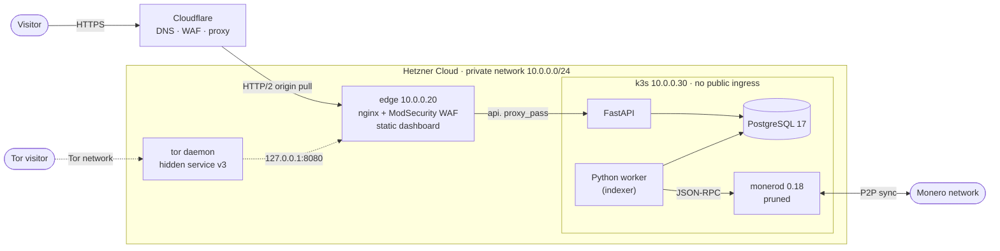
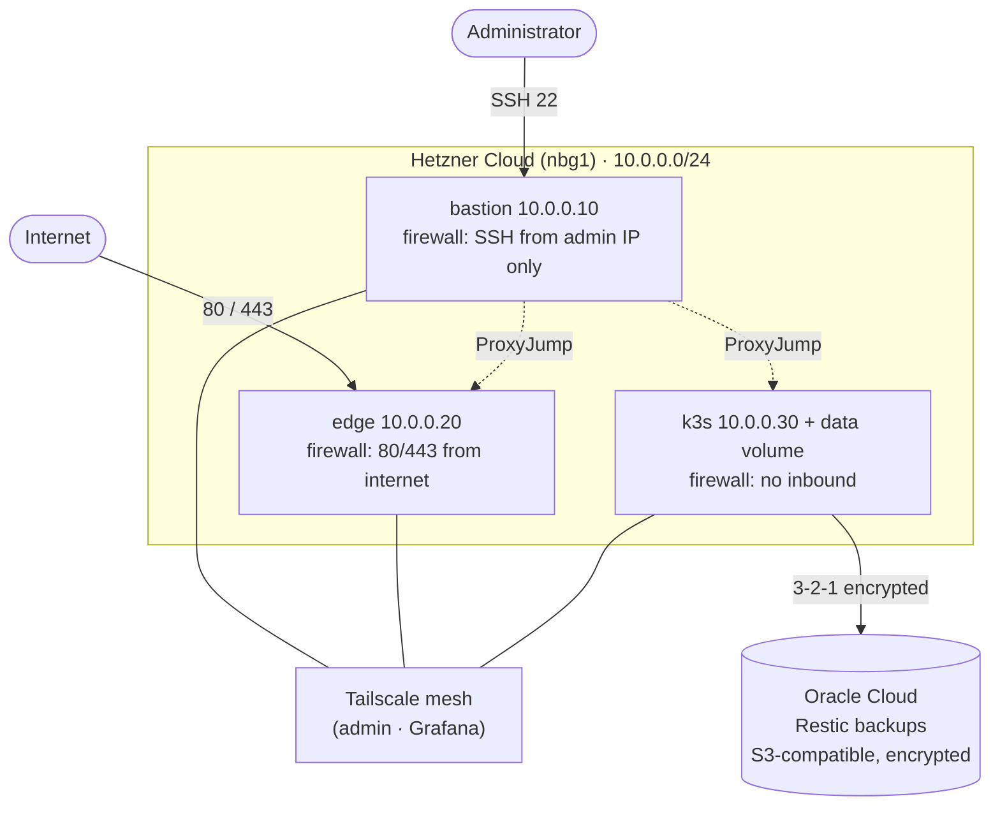
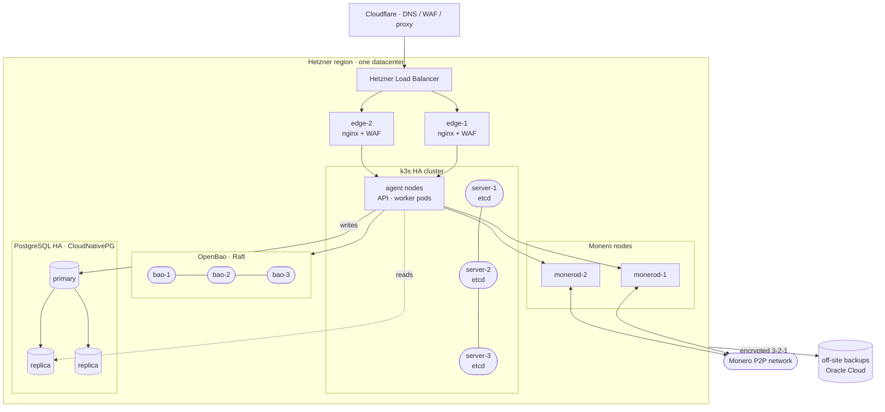
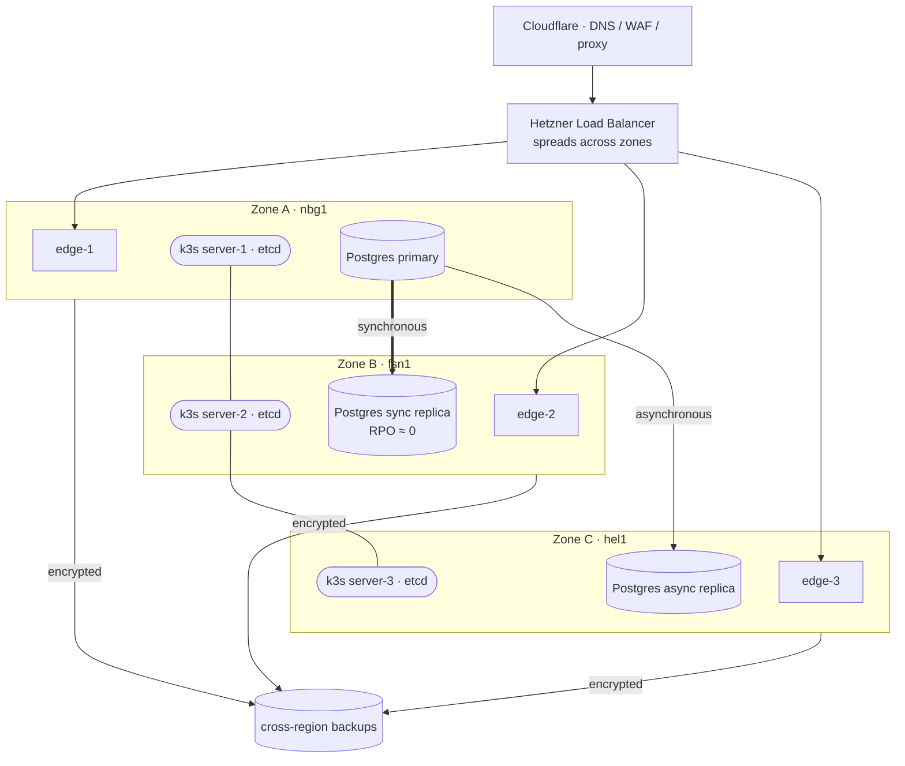
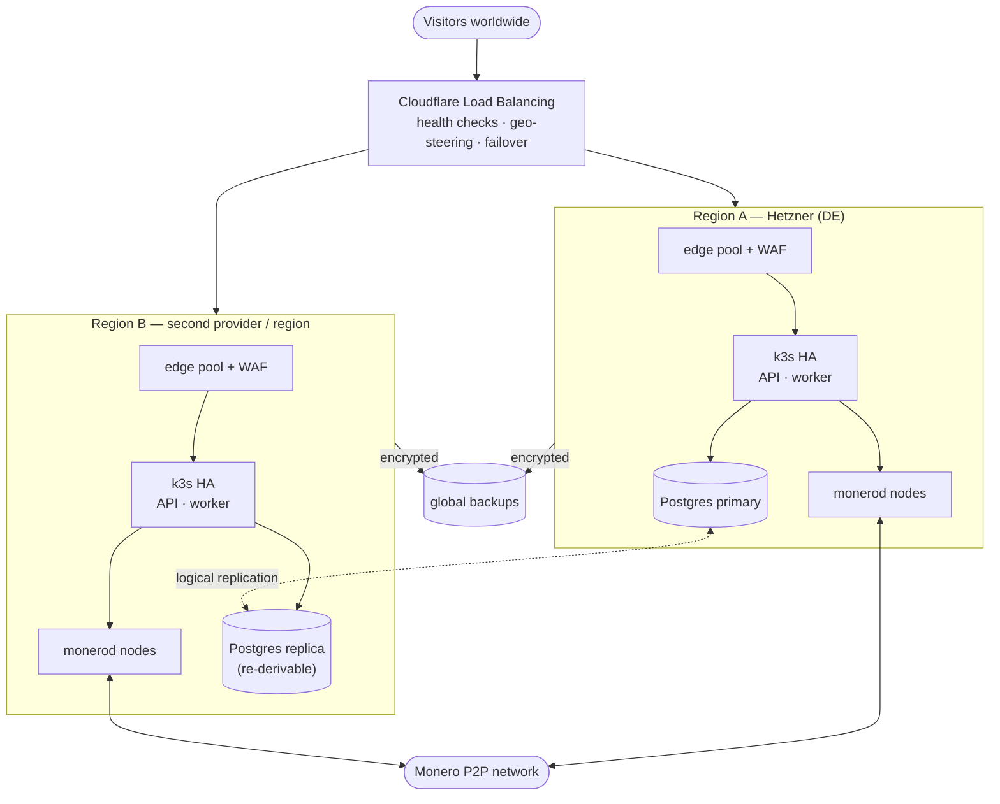
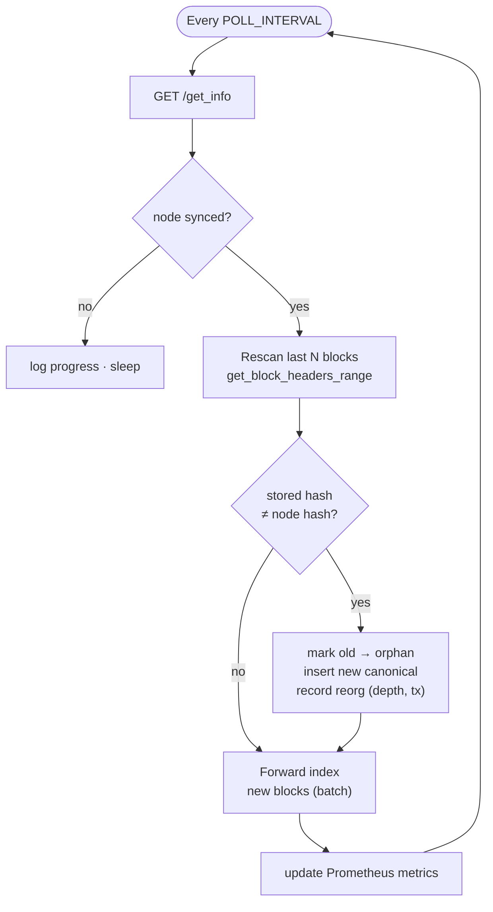

# monerometrics

> A reorg-aware observatory for the health of the Monero network — public dashboard + API.

[](LICENSE)
[](https://www.terraform.io/)
[](https://www.getmonero.org/)

`monerometrics` measures and historizes the health of the Monero network: network hashrate,
block time, mempool state, mining-pool distribution and — above all — **chain reorganizations
(reorgs) and orphan blocks**, which most block explorers surface poorly.

The project was born from the **August 2025 Qubic episode**, during which a mining pool
approached a majority of the network hashrate and triggered reorganizations, raising concerns
about Monero's resilience. The public debate lacked reliable, accessible data to settle it.
monerometrics fills that gap with a neutral, verifiable, reorg-aware observatory.

It is **open-source and self-funded**, with no ads and no tracking. The dashboard and the API
are **free and open, permanently** — there is no paid tier, and there will not be one.

> **From a diploma project to a community tool.** monerometrics V1 was built and defended as a
> French professional IT-infrastructure project — and it earned the diploma. With that chapter
> closed, the goal of V2 is to hand the project over to the **Monero community**: fully
> open-source, self-funded, and useful well beyond a classroom.

- **Dashboard** — [monerometrics.net](https://monerometrics.net)
- **Public API** — [api.monerometrics.net](https://api.monerometrics.net) (OpenAPI documented)
- **Tor hidden service** — `6wbhchvavey26lbtscl6w6qg76balycixtsklcggrsslyk4xah6sbbad.onion`
  (dashboard + API, no Cloudflare, no IP exposure — see [Access over Tor](#access-over-tor))

---

## What it does

- **Dashboard** — React SPA: network hashrate, block-time variance, mempool history, block
  reward / emission, mining-pool distribution with **centralization metrics (largest-pool share
  and Nakamoto coefficient)**, an interactive chain-fork visualizer and reorg/orphan history.
  Available in **English, French and Spanish**, light/dark themes.
- **Public API** — FastAPI, 13 read-only JSON endpoints grouped by theme (service, network,
  chain/reorgs, pools). Automatically documented via OpenAPI.
- **Reorg detection** — a Python worker reads each block from a synced node, computes the
  indicators and **detects reorganizations** by re-checking a rolling window of recent blocks
  against the node, recording their real depth and the transactions they displaced.

## Architecture

A visitor reaches the dashboard or API through Cloudflare, which terminates TLS and applies its
edge protections, then forwards to a hardened **edge** server (nginx + ModSecurity WAF). The
edge serves the static dashboard and reverse-proxies the API to the **k3s** node, where the
application core runs: a Monero node, the indexer, PostgreSQL and the API.

A second, independent path exists: a **Tor hidden service** running on the edge, which bypasses
Cloudflare entirely and serves both the dashboard and the API on a single origin.



## Access over Tor

The dashboard is also published as a **Tor v3 hidden service**, giving a path to the data that
does not depend on Cloudflare and does not expose the visitor's IP address:

```
6wbhchvavey26lbtscl6w6qg76balycixtsklcggrsslyk4xah6sbbad.onion
```

Design notes:

- **One origin, no leaks.** The hidden service serves the dashboard on `/` and reverse-proxies
  the API under `/api`. The SPA detects an `.onion` host at runtime and switches to that
  relative path, so **no browser request ever leaves the hidden service** for the clearnet.
  A single build serves both clearnet and Tor.
- **No TLS, on purpose.** Tor already encrypts and authenticates end to end, and the `.onion`
  address *is* the service's public key. A certificate would add nothing.
- **Not reachable from the internet.** The `.onion` vhost listens on `127.0.0.1:8080` only, so
  the Tor daemon is the sole thing that can reach it — no firewall rule, no exposed port. Tor
  makes outbound connections only; nothing inbound is opened.
- **No logs.** Every request arrives from `127.0.0.1` (Tor carries no client IP), so access
  logging is disabled on this vhost: it would record nothing useful.
- **Discoverable.** The clearnet site advertises the service with an `Onion-Location` header,
  so Tor Browser offers to switch automatically.
- **Rate limiting.** Since per-IP limiting is meaningless over Tor, hidden-service traffic is
  tagged by nginx and isolated in a dedicated bucket with a much higher ceiling — the API stays
  protected from abuse without Tor users evicting each other. The tagging header is stripped on
  the clearnet vhosts, so it cannot be forged from the internet.

It is deployed by the `tor` Ansible role (`config/ansible/roles/tor/`).

## Infrastructure

The platform runs on **Hetzner Cloud** (region Nuremberg) as three Ubuntu 24.04 servers on a
private network, each protected by its own Hetzner firewall. Administration is done over a
**Tailscale** (WireGuard) zero-trust mesh; Grafana is reachable over Tailscale only, never from
the internet. The encrypted off-site backups live on a separate cloud (**Oracle Cloud**,
S3-compatible object storage) to isolate failure domains.



| Server | Type | Public exposure | Role |
|---|---|---|---|
| `bastion` | CX23 | SSH from admin IP only | Sole SSH entry point, ProxyJump to the others |
| `edge` | CX23 | 80/443 from the internet | nginx reverse proxy + ModSecurity WAF, serves the static dashboard |
| `k3s` | CX33 + 128 GB volume | none (outbound only) | k3s cluster: monerod, worker, PostgreSQL, API, OpenBao |

Key choices:

- **Defense in depth.** Per-server firewalls, a single SSH entry point, a WAF on the only public
  web surface, a zero-trust admin mesh, and a k3s node with **no inbound exposure at all**
  (admin and edge reach it over the private network; its public IP is outbound-only, for node
  sync and image pulls).
- **HTTP/2 origin behind Cloudflare.** Both the client-facing (Cloudflare) and origin (nginx)
  hops run HTTP/2, with the ModSecurity WAF fully active on HTTP/2 traffic.
- **Everything is Infrastructure-as-Code.** Hetzner resources via **Terraform**
  (`hcloud` + `cloudflare` providers), server configuration and CIS-aligned hardening via
  **Ansible**. Container images are built and published to GHCR.
- **Secrets** are managed with **OpenBao** (a free fork of Vault); supervision with
  **Prometheus + Grafana**; backups with **Restic** (3-2-1, cross-cloud, tested restore —
  see [`k8s/monerometrics/BACKUP-PRA.md`](k8s/monerometrics/BACKUP-PRA.md)).

## Toward high availability (target architecture)

> **These topologies are the production target, not what runs today.** The live platform is a
> deliberately lean **single-node POC**: one k3s node (a single point of failure), one
> unreplicated PostgreSQL, one edge. It is honest, cheap (~28 €/month) and enough to prove the
> product — but the k3s node, the database and the edge are all SPOFs. The plan below removes
> them **in tiers**, each independently fundable, so infrastructure grows with the project's
> community funding rather than ahead of it.

One property makes high availability unusually cheap here: **every metric is deterministically
derived from the Monero blockchain**. The database is a materialized cache, not a source of
truth — any replica or whole region can be **re-indexed from its own local `monerod`**. Reads are
therefore naturally active-active, and losing a stack means rebuilding from first principles, not
losing data.

### Tier 1 — Highly-available application, single region

Remove every in-region SPOF: a load balancer in front of a redundant edge pool, a 3-node k3s
control plane (etcd quorum), a replicated PostgreSQL with automatic failover, OpenBao in Raft HA,
and redundant Monero nodes.



### Tier 2 — Multi-zone HA (one provider, several datacenters)

Spread the cluster across Hetzner locations (e.g. `nbg1` / `fsn1` / `hel1`). The etcd quorum and
edge pool survive the loss of an entire zone; a **synchronous** PostgreSQL replica in a second
zone gives near-zero RPO on failover, with an asynchronous copy in a third.



### Tier 3 — Multi-region active-active (aspirational)

Two (or more) full stacks in different regions/providers, steered by **Cloudflare Load
Balancing** with health checks, geo-routing to the nearest healthy region and automatic failover.
Each region indexes from its **own** Monero nodes, so read traffic is served locally and a region
can be rebuilt independently; only the write path needs coordinated replication.



## How the indexer works

The worker ([`apps/worker/indexer.py`](apps/worker/indexer.py)) is the heart of the project. Every
`POLL_INTERVAL` seconds it asks `monerod` for its state (`/get_info`) and, when the node is
synced, runs **two passes** against the database:

1. **Confirmation-window rescan (reorg detection).** It re-fetches the headers of the last
   `CONFIRMATION_WINDOW` blocks (default 60) in a single `get_block_headers_range` call and
   compares each block hash to the canonical hash already stored. Any mismatch is a
   reorganization: the previously stored block is flagged **orphan** (`is_canonical = false`),
   the node's new block becomes canonical, and a row is written to `reorgs_detected` with the
   **real depth** (number of contiguous rewritten heights) and **affected transaction count**
   (sum of the orphaned blocks' tx counts). This pass is what makes reorg detection actually
   work — plain forward-only indexing never revisits the past, so it would silently miss every
   reorg that rewrites already-indexed heights.

2. **Forward indexing.** It then fetches the new blocks above the last indexed height. Close to
   the tip it pulls **full blocks** one by one for accurate pool attribution; when it is far
   behind (fresh deploy), it switches to a **fast header backfill** (`get_block_headers_range`,
   ~1000 blocks per call), which is enough for the network-health series and lets the long
   windows (90 d, 1 y, 5 y) fill with real history in well under two hours instead of never.



**Mining-pool attribution** ([`apps/worker/pools.py`](apps/worker/pools.py)) cross-references each
block hash against an index `{block_hash → pool}` rebuilt every ~2 minutes from the **public block
lists of the pools themselves**. Attribution is therefore verified on-chain (hash match), not
inferred from a pool's self-reported hashrate. If a hash isn't found, a structural P2Pool
heuristic (multi-output coinbase) is tried; otherwise the block is `unknown`.

Source APIs aggregated:

| Pool | Endpoint | Method / depth |
|---|---|---|
| supportxmr.com | `www.supportxmr.com/api/pool/blocks` | `?limit=` (up to 10000) |
| p2pool | `p2pool.observer/api/pool/blocks` | `?limit=` (up to 1000) |
| hashvault.pro | `api.hashvault.pro/v3/monero/pool/blocks` | `?limit=&page=0` (up to 10000) |
| moneroocean.stream | `api.moneroocean.stream/pool/blocks` | `?limit=100` (capped by pool) |
| c3pool.com | `api.c3pool.org/pool/blocks` | `?limit=` (up to 10000) |
| nanopool.org | `xmr.nanopool.org/api/v1/pool/blocks/0/{n}` | path count (~4600) |
| kryptex.com | `pool.kryptex.com/xmr/api/v1/pool/blocks` | paginated via `next` (~100, pool cap) |
| herominers.com | `monero.herominers.com/api/get_blocks` | paginated by `?height=` |
| xmrpool.eu | `web.xmrpool.eu:8119/get_blocks` | paginated by `?height=` |
| monerohash.com | `monerohash.com/api/get_blocks` | paginated by `?height=` |

Coverage is ~70-75% of blocks. The remainder is **structurally unattributable** — the same ceiling
every public tracker hits (xmrstats, miningpoolstats): Monero's privacy means pools don't sign
their coinbase on-chain, the Qubic pool publishes no block list at all, and solo miners are
invisible by design. All land in `unknown`, which we report honestly rather than guessing.

The reachability and block count of every source API is tracked by the indexer and published at
[`/pools/sources`](https://api.monerometrics.net/pools/sources) (also shown on the dashboard's
Documentation page), so a silently failing source is visible instead of quietly inflating
`unknown`. Recent `unknown` blocks are re-attributed automatically on each cycle as pools publish,
so coverage self-repairs within minutes without manual action.

**Observability.** The worker exposes Prometheus metrics on `:9100/metrics` (indexing lag, reorg
counter, sync state, pool-index size, last-loop timestamp) and writes a heartbeat file consumed
by a Kubernetes liveness probe, so a stalled loop gets restarted automatically.

## Data model

Two tables in PostgreSQL ([`k8s/monerometrics/20-configmap-postgres-init.yaml`](k8s/monerometrics/20-configmap-postgres-init.yaml)),
read-only from the API's point of view:

- **`blocks`** — the primary key is the **block hash**, *not* the height. This is deliberate: it
  lets several blocks coexist at the same height (the canonical one plus the orphans left behind
  by a reorg). A **partial unique index** (`UNIQUE (height) WHERE is_canonical`) guarantees there
  is exactly one canonical block per height at any instant. Columns include `height`, `prev_hash`,
  timestamps, `difficulty`, `tx_count`, `miner_pool`, `reward_xmr` (stored as an exact `NUMERIC`,
  not a float) and the `is_canonical` flag.
- **`reorgs_detected`** — one row per detected reorganization event: `fork_point_height`, `depth`,
  `old_chain_tip_hash`, `new_chain_tip_hash`, `affected_tx_count` and `detected_at`.

The orphan/canonical split is what powers the dashboard's chain-fork visualizer and the
`/orphans/recent` and `/reorgs/stats` endpoints.

## API reference

The API ([`apps/api/`](apps/api/)) is **read-only** and returns JSON. It is built with FastAPI,
so an interactive OpenAPI schema is served at
[`api.monerometrics.net/docs`](https://api.monerometrics.net/docs) (raw schema at `/openapi.json`).
Responses for the heavy aggregations are cached (~60 s) and every IP is rate-limited
(120 requests/minute by default; Tor hidden-service traffic gets its own shared bucket with a
higher ceiling, since per-IP limiting is meaningless there); CORS is open for `GET` so the API
can be consumed from anywhere. No key, no account, no tracking.

`window` accepts `1h`, `24h`, `7d`, `30d`, `90d`, `1y`, `5y` unless noted otherwise.

**Service**

| Endpoint | Description |
|---|---|
| `GET /health` | Liveness + database connectivity check. |
| `GET /info` | Global metadata: API version, latest indexed height, total blocks, orphans, reorgs. |

**Network**

| Endpoint | Description |
|---|---|
| `GET /network/info` | Current state: sync status, mempool size, difficulty, estimated hashrate (live from the node). |
| `GET /network/hashrate?window=` | Historical network hashrate (difficulty / 120 s), bucketed by the window. |
| `GET /network/blocktime?window=` | Variance of the time between consecutive canonical blocks (target 120 s). `window` = `1h\|24h\|7d\|30d`. |
| `GET /network/mempool?window=` | Mempool size (pending transactions) over time, sampled each worker poll. |
| `GET /network/emission?window=` | Average block reward over time — Monero tail emission (~0.6 XMR/block). `window` excludes `1h`. |

**Chain & reorgs**

| Endpoint | Description |
|---|---|
| `GET /chain/window?from=&to=` | Raw block window between two heights (max 1000 blocks). |
| `GET /chain/fork-window?limit=` | Latest N blocks including orphans, with fork-point flags (powers the chain visualizer). `limit` = 10..500. |
| `GET /reorgs?limit=` | Most recent detected reorganizations. `limit` = 1..1000. |
| `GET /reorgs/stats` | Reorg statistics aggregated over 24h / 7d / 30d (count, avg/max depth, affected tx). |
| `GET /orphans/recent?limit=` | Recent orphan blocks with their competing canonical block. `limit` = 1..500. |

**Mining pools**

| Endpoint | Description |
|---|---|
| `GET /pools/distribution?window=` | Block share per pool over the window, plus decentralization metrics: largest-pool share and **Nakamoto coefficient**. `window` = `1h\|6h\|24h\|48h\|7d`. |
| `GET /pools/sources` | Reachability of each pool API used for attribution (status measured by the indexer, not by your browser). |

## Repository layout

```
apps/          Application code
  dashboard/   React + Vite SPA (EN/FR/ES)
  api/         FastAPI service
  worker/      Python indexer (reorg detection) + shared pool module
infra/         Terraform — modules (network, server, dns) + environments
config/        Ansible — inventory, playbooks, roles (hardening, nginx, tor, k3s, ...)
k8s/           Kubernetes (k3s) manifests + backup/DR runbook (BACKUP-PRA.md)
scripts/       Helpers (env loader)
```

## Deploying

The whole platform is reproducible from code. With a Hetzner project, a Cloudflare-managed
domain and the required tokens in your environment:

```bash
# 1. Load tokens (HCLOUD_TOKEN, CLOUDFLARE_API_TOKEN, TAILSCALE_AUTH_KEY, GHCR) from the keychain
source scripts/load-env.sh

# 2. Provision the servers, private network, firewalls and DNS records
cd infra/environments/poc
terraform init
terraform apply        # creates bastion, edge, k3s + Cloudflare A records

# 3. Configure and harden the servers (CIS L1, nginx+WAF, k3s, data volume, Tailscale)
cd ../../../config/ansible
ansible-playbook site.yml

# 4. Deploy the application workloads on k3s
kubectl apply -k k8s/monerometrics/
```

Server sizing, datacenter and the data-volume size are Terraform variables
(see [`infra/environments/poc/terraform.tfvars.example`](infra/environments/poc/terraform.tfvars.example)).

**Secrets are managed by OpenBao only** — there is no plaintext credential in the cluster
manifests. Seed the database credentials once, and every consumer (PostgreSQL, worker, API,
backup) reads them from there:

```bash
# Database credentials (read by PostgreSQL, worker, API, backup)
bao kv put secret/postgres/credentials \
  POSTGRES_USER=monerometrics POSTGRES_DB=monerometrics POSTGRES_PASSWORD='<strong-password>'

# Backup credentials — Restic repository + OCI S3-compatible keys (read by the backup job)
bao kv put secret/restic/credentials \
  RESTIC_REPOSITORY='s3:https://<oci-endpoint>/<bucket>' RESTIC_PASSWORD='<restic-password>' \
  AWS_ACCESS_KEY_ID='<key>' AWS_SECRET_ACCESS_KEY='<secret>' AWS_DEFAULT_REGION='<region>'
```

OpenBao Kubernetes auth roles must allow: `monerometrics-postgres` / `-worker` / `-api` to read
`secret/postgres/credentials`, and `monerometrics-backup` to read **both**
`secret/postgres/credentials` and `secret/restic/credentials`.

## Local development (dashboard)

```bash
cd apps/dashboard
npm install
npm run dev      # local dev server
npm run build    # production build to dist/
```

The dashboard reads the public API; point it at `api.monerometrics.net` (see `src/api.js`).

## Security & secrets

- **No secret in the repo.** Credentials are pulled from the macOS Keychain / environment at
  runtime (`scripts/load-env.sh`) or stored in OpenBao. Terraform state is kept out of the repo.
- Defense in depth: firewall segmentation, SSH bastion, WAF, zero-trust admin mesh, risk analysis
  (EBIOS RM) and a tested cross-cloud disaster-recovery plan.

## Support the project

monerometrics runs on a modest self-funded infrastructure (no ads, no tracking, no data sold).
A Monero donation address is available on the dashboard.

## License

MIT — see [`LICENSE`](LICENSE).

---

**No advertising. No tracking. No data sold. Just Monero network data, done honestly.**
