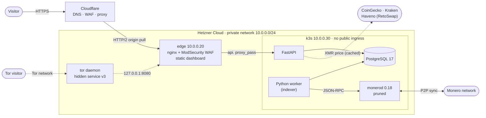
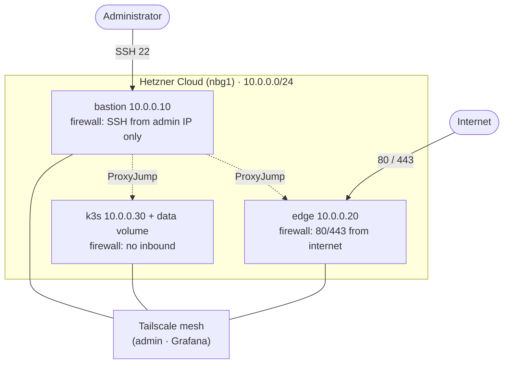
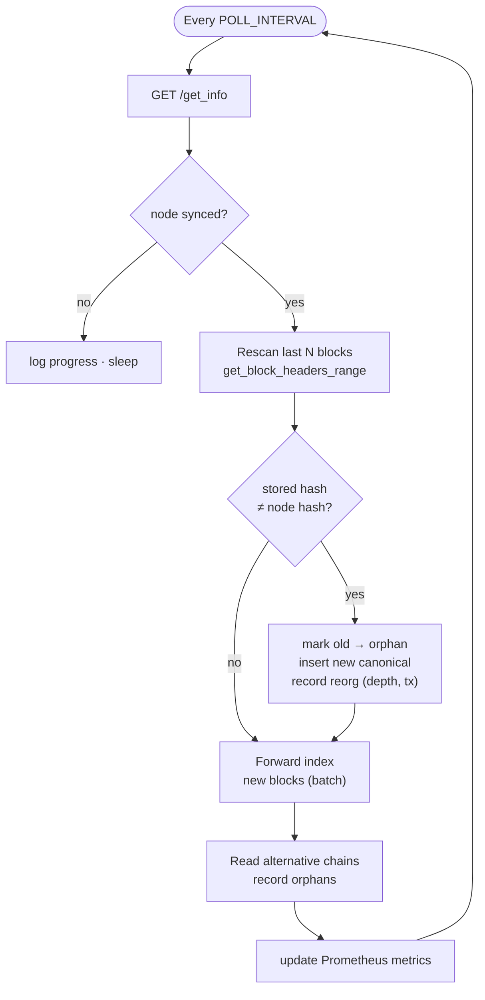
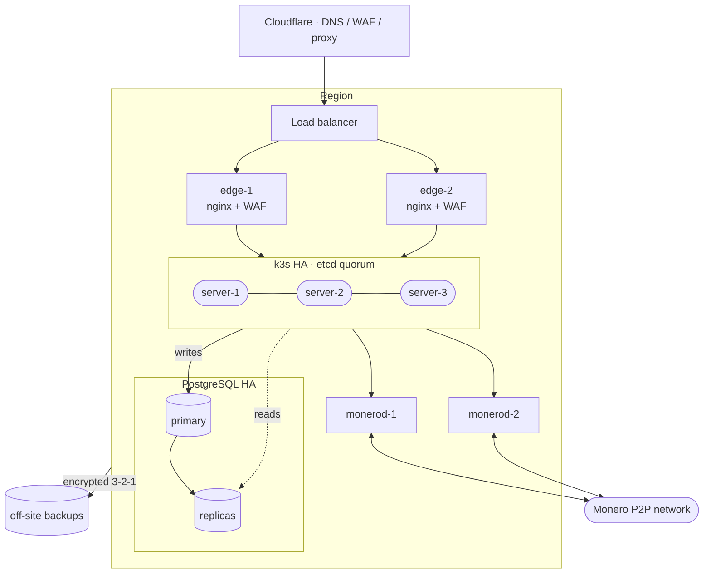

# monerometrics

> A reorg-aware observatory for the health of the Monero network: public dashboard + API.

[](LICENSE)
[](https://www.terraform.io/)
[](https://www.getmonero.org/)
[](https://kuno.anne.media/fundraiser/xyf8/)

**monerometrics is community-funded.** A [Kuno campaign](https://kuno.anne.media/fundraiser/xyf8/) funds the next two years: hosting, FCMP++ readiness, free reorg alerts, open data export and a second node.

`monerometrics` measures and historizes the health of the Monero network: network hashrate,
block time, mempool state, mining-pool distribution and, above all, **chain reorganizations
(reorgs) and orphan blocks**, which most block explorers surface poorly.

The project was born from the **August 2025 Qubic episode**, during which a mining pool paying
miners in its own token approached a majority of the network hashrate, then withheld blocks and
released a longer private chain. On 14 September 2025 that produced an 18-block reorganization at
height 3,499,659 that erased about 36 minutes of history, well past the 10 confirmations everyone treated as
final: transactions thought settled were suddenly unconfirmed again. The public debate lacked reliable, accessible
data to settle it. monerometrics fills that gap with a neutral, verifiable, reorg-aware observatory.

It is **open-source and self-funded**, with no ads and no tracking. The dashboard and the API
are **free and open, permanently**: there is no paid tier, and there will not be one.

> **From a diploma project to a community tool.** monerometrics V1 was built and defended as a
> French professional IT-infrastructure project, and it earned the diploma. With that chapter
> closed, the goal of V2 is to hand the project over to the **Monero community**.

- **Dashboard**: [monerometrics.net](https://monerometrics.net)
- **Public API**: [api.monerometrics.net](https://api.monerometrics.net) (OpenAPI documented)
- **MCP server**: `https://api.monerometrics.net/mcp` (Streamable HTTP; in the [MCP Registry](https://registry.modelcontextprotocol.io/?search=monerometrics))
- **Tor hidden service**: `6wbhchvavey26lbtscl6w6qg76balycixtsklcggrsslyk4xah6sbbad.onion`
  (dashboard + API, no Cloudflare, no IP exposure, see [Access over Tor](#access-over-tor))

---

## What it does

**Dashboard**, a React SPA in four sections, available in English, French and Spanish, light and
dark themes, readable on a phone:

- *Consensus and reorganizations*: a chain-fork visualizer that draws competing branches as a
  tree, reorg statistics by window up to everything recorded, and orphan history. Each block names
  its pool and how the attribution was established, and merge-mined blocks are flagged.
- *Mining concentration*: pool distribution, the combined share of the two largest pools, and the
  evidence behind each attribution.
- *Network state*: hashrate, block-time variance, mempool, emission, and a **transaction fee
  estimator** reading the node's four priority tiers live.
- *Peer-to-peer market*: Haveno premium over spot on **both sides of the book**, live order-book
  depth, resting liquidity, and **premium by payment method**.
- **Transaction search**: paste a transaction hash and get what Monero actually makes public about
  it, plus which pool mined its block and whether that height was ever contested by a reorg. The
  hash travels in a POST body, so it never lands in a URL.
- Every time series is navigable: a range strip under each chart, drag to move through time,
  zoom, and statistics that follow the visible window rather than the whole series.

**Public API**: FastAPI, read-only JSON endpoints grouped by theme, documented via OpenAPI.

**Reorg detection**: a Python worker reads each block from a synced node, computes the indicators
and **detects reorganizations** by re-checking a rolling window of recent blocks against the node,
recording their real depth and the transactions they displaced.

## Architecture

A visitor reaches the dashboard or API through Cloudflare, which terminates TLS and applies its
edge protections, then forwards to a hardened **edge** server (nginx + ModSecurity WAF). The
edge serves the static dashboard and reverse-proxies the API to the **k3s** node, where the
application core runs: a Monero node, the indexer, PostgreSQL and the API.

A second, independent path exists: a **Tor hidden service** running on the edge, which bypasses
Cloudflare entirely and serves both the dashboard and the API on a single origin, behind the same
WAF.


```mermaid
flowchart LR
    User(["Visitor"]) -->|HTTPS| CF["Cloudflare<br/>DNS · WAF · proxy"]
    CF -->|"HTTP/2 origin pull"| Edge
    Tor(["Tor visitor"]) -.->|"Tor network"| Onion
    subgraph HZ["Hetzner Cloud · private network 10.0.0.0/24"]
        Onion["tor daemon<br/>hidden service v3"]
        Edge["edge 10.0.0.20<br/>nginx + ModSecurity WAF<br/>static dashboard"]
        Onion -.->|"127.0.0.1:8080"| Edge
        subgraph K3S["k3s 10.0.0.30 · no public ingress"]
            API["FastAPI"]
            Worker["Python worker<br/>(indexer)"]
            DB[("PostgreSQL 17")]
            Node["monerod 0.18<br/>pruned"]
        end
        Edge -->|"api. proxy_pass"| API
        API --> DB
        Worker --> DB
        Worker -->|JSON-RPC| Node
    end
    Node <-->|"P2P sync"| Monero(["Monero network"])
    API -.->|"XMR price (cached)"| Price(["CoinGecko · Kraken<br/>Haveno (RetoSwap)"])
```

## Access over Tor

The dashboard is also published as a **Tor v3 hidden service**, giving a path to the data that
does not depend on Cloudflare and does not expose the visitor's IP address:

```
6wbhchvavey26lbtscl6w6qg76balycixtsklcggrsslyk4xah6sbbad.onion
```

- **One origin, no leaks.** The hidden service serves the dashboard on `/` and reverse-proxies the
  API under `/api`. The SPA detects an `.onion` host at runtime and switches to that relative path,
  so no browser request ever leaves the hidden service for the clearnet. One build serves both.
- **No TLS, on purpose.** Tor already encrypts and authenticates end to end, and the `.onion`
  address *is* the service's public key.
- **Same WAF.** The hidden-service vhost runs the same ModSecurity rules as the clearnet site, so
  Tor is not a way around the filtering.
- **Not reachable from the internet.** The `.onion` vhost listens on `127.0.0.1:8080` only, so the
  Tor daemon is the sole thing that can reach it. Tor makes outbound connections only.
- **No logs.** Every request arrives from `127.0.0.1`, so access logging on this vhost would record
  nothing useful and is disabled.
- **Discoverable.** The clearnet site advertises it with an `Onion-Location` header.
- **Rate limiting.** Per-IP limiting is meaningless over Tor, so hidden-service traffic is tagged by
  nginx and isolated in its own bucket with a higher ceiling. The tagging header is stripped on the
  clearnet vhosts, so it cannot be forged from the internet.

Deployed by the `tor` Ansible role (`config/ansible/roles/tor/`).

## Infrastructure

The platform runs on **Hetzner Cloud** (Nuremberg) as three Ubuntu 24.04 servers on a private
network, each behind its own firewall. Administration goes over a **Tailscale** (WireGuard) mesh;
Grafana is reachable over Tailscale only. Backups are **paused**: the tooling (Restic, encrypted,
see [`k8s/monerometrics/BACKUP-PRA.md`](k8s/monerometrics/BACKUP-PRA.md)) stays in the repository,
but no scheduled backup runs today.


```mermaid
flowchart TB
    Admin(["Administrator"]) -->|"SSH 22"| Bastion
    Internet(["Internet"]) -->|"80 / 443"| Edge
    subgraph HZ["Hetzner Cloud (nbg1) · 10.0.0.0/24"]
        Bastion["bastion 10.0.0.10<br/>firewall: SSH from admin IP only"]
        Edge["edge 10.0.0.20<br/>firewall: 80/443 from internet"]
        K3s["k3s 10.0.0.30 + data volume<br/>firewall: no inbound"]
        Bastion -. ProxyJump .-> Edge
        Bastion -. ProxyJump .-> K3s
    end
    Mesh["Tailscale mesh<br/>(admin · Grafana)"]
    Bastion --- Mesh
    Edge --- Mesh
    K3s --- Mesh
```

| Server | Type | Public exposure | Role |
|---|---|---|---|
| `bastion` | CX23 | SSH from admin IP only | Sole SSH entry point, ProxyJump to the others |
| `edge` | CX23 | 80/443 from the internet | nginx reverse proxy + ModSecurity WAF, serves the dashboard |
| `k3s` | CX33 + 128 GB volume | none (outbound only) | k3s cluster: monerod, worker, PostgreSQL, API, OpenBao |

Key choices: per-server firewalls, a single SSH entry point, a WAF on the only public web surface,
a zero-trust admin mesh, and a k3s node with **no inbound exposure at all**. Both hops run HTTP/2
with the WAF active. Everything is Infrastructure-as-Code: Hetzner and Cloudflare resources via
**Terraform**, server configuration and CIS-aligned hardening via **Ansible**, images published to
GHCR. Supervision with **Prometheus + Grafana**, with alert rules on indexing, node sync, disk and
failing workloads. The backup tooling (**Restic**) is kept but paused.

**Secrets.** The cluster is provisioned with **OpenBao** (a free fork of Vault) and the manifests
carry no plaintext credential. OpenBao is currently sealed and the workloads read their database
credentials from a Kubernetes Secret (`postgres-credentials-fallback`) instead. Unsealing is a
manual step after any restart, the trade-off of a single node; the fallback keeps the service up.

### Running cost

From the Hetzner invoice, per hour of use, excluding VAT:

| Item | Unit price | Monthly (730 h) |
| --- | --- | --- |
| 2 × CX23 (`bastion`, `edge`) | 0.0088 €/h | 12.85 € |
| 1 × CX33 (`k3s`) | 0.0136 €/h | 9.93 € |
| 3 × primary IPv4 | 0.0008 €/h | 1.75 € |
| 128 GB volume | 0.0572 €/GB-month | 7.32 € |
| **Total** | | **31.85 € excl. VAT · 38.22 € incl. VAT** |

Cloudflare, Let's Encrypt, Tailscale and GitHub Actions are on free tiers.

The volume is the item that moves, and the chain drives it, not indexing. The pruned Monero
blockchain takes **106 GB**; the entire indexed database, 3.77 M blocks and every time series, takes
**3.1 GB**, about 540 bytes per block, and grows by roughly 150 MB a year.

Growth is measured from the indexed data rather than estimated. Summing the recorded size of every
canonical block gives 186.8 GB for the full chain, so this pruned node keeps a bit over half of
Monero. The chain grew **22.18 GB over the last twelve full months**, which is **12.35 GB a year on
disk**, steady across years (17.5 GB in 2022, 18.3 in 2023, 29.1 in 2024, 22.2 in 2025). At **94 %
full**, the 128 GB volume has about seven months left, so the plan is to take it to 160 GB
(+1.83 €/month) and no further, since the same measurement says larger would sit unused.

## How the indexer works

The worker ([`apps/worker/indexer.py`](apps/worker/indexer.py)) is the heart of the project. Every
`POLL_INTERVAL` seconds it asks `monerod` for its state and, when the node is synced, runs **three
passes**:

1. **Confirmation-window rescan (reorg detection).** It re-fetches the headers of the last
   `CONFIRMATION_WINDOW` blocks (default 60) in one call and compares each hash to the canonical
   hash already stored. Any mismatch is a reorganization: the stored block is flagged **orphan**
   (`is_canonical = false`), the node's block becomes canonical, and a row is written to
   `reorgs_detected` with the **real depth** and the **affected transaction count**. This pass is
   what makes reorg detection work at all: forward-only indexing never revisits the past, so it
   would silently miss every reorg that rewrites already-indexed heights.

   **The window is also the detection ceiling.** A reorganization deeper than `CONFIRMATION_WINDOW`
   rewrites heights the rescan never looks at, so it would be missed entirely rather than reported
   with a wrong depth. At 60 blocks the margin is wide, the deepest Monero reorg on record was 18
   blocks, but the limit is structural and the counts published here are complete only up to that
   depth. Raising it costs one larger header call per poll.

   The transaction count is `num_txes`, which excludes the coinbase, so it counts transactions
   users actually broadcast rather than the miner's own output.

2. **Forward indexing.** It fetches the blocks above the last indexed height. Close to the tip it
   pulls **full blocks** one by one for accurate attribution; far behind (fresh deploy) it switches
   to a **fast header backfill** (~1000 blocks per call), enough for the network-health series and
   fast enough to fill the long windows in under two hours instead of never.

3. **Alternative chains (orphans).** Most competing blocks are settled within seconds, long before
   the next poll, so the rescan above never sees them: it only catches a block we had already
   indexed. The worker therefore also reads the node's own alternative chains
   (`get_alternate_chains`, on an RPC port only the worker can reach) and records every competing
   block as an orphan. Before this pass, about one orphan in four was recorded.


```mermaid
flowchart TB
    Start(["Every POLL_INTERVAL"]) --> Info["GET /get_info"]
    Info --> Sync{"node synced?"}
    Sync -->|no| Wait["log progress · sleep"]
    Sync -->|yes| Rescan["Rescan last N blocks<br/>get_block_headers_range"]
    Rescan --> Diff{"stored hash<br/>≠ node hash?"}
    Diff -->|yes| Reorg["mark old → orphan<br/>insert new canonical<br/>record reorg (depth, tx)"]
    Diff -->|no| Fwd
    Reorg --> Fwd["Forward index<br/>new blocks (batch)"]
    Fwd --> Alt["Read alternative chains<br/>record orphans"]
    Alt --> Metrics["update Prometheus metrics"]
    Metrics --> Start
```

**Observability.** The worker exposes Prometheus metrics on `:9100/metrics` (indexing lag, reorg
counter, sync state, pool-index size, blocks proven by view key, attribution conflicts) and writes
a heartbeat file consumed by a Kubernetes liveness probe. The heartbeat is written only after a
successful pass, so a loop that keeps failing is restarted and raises the `WorkerStalled` alert.

## Mining-pool attribution

Monero is private by design: a coinbase carries no pool name, and stealth addresses mean you cannot
look up "who was paid". Attribution has to be **established**, never assumed.

monerometrics never infers a pool's share from its **self-reported hashrate**. It only counts
blocks it can tie to a pool by evidence, and records **which kind of evidence** was used, per
block, in `blocks.pool_source`.

**1. View-key proof, cryptographic (`viewkey_proof`).** Some pools publish their wallet primary
address and secret view key (see [blocks.p2pool.observer/proofs](https://blocks.p2pool.observer/proofs)).
A view key only reveals *incoming* transactions; it cannot spend. That is enough to prove ownership
of a coinbase output, with no trust in anyone's API:

```
R          = transaction public key, parsed out of the coinbase tx_extra (tag 0x01)
derivation = 8 · a · R                      (a = the pool's secret view key)
P_expected = Hs(derivation ‖ varint(i)) · G + B    (B = the pool's public spend key)
```

If `P_expected` equals the output key at index `i`, that output pays the pool's wallet: a
mathematical fact, independent of any pool API, and therefore **immune to the reporting lag** that
makes fresh blocks look unattributed. Implemented from scratch in
[`apps/worker/pool_proofs.py`](apps/worker/pool_proofs.py) (ed25519 point arithmetic, Keccak-256,
Monero base58), about 33 ms per block.

**2. Pool block lists, cross-referenced (`pool_api`).** Pools that publish no view key still publish
the blocks they found. Those lists are aggregated every ~2 minutes into an index
`{block_hash → pool}` and matched **by block hash**, so the claim is anchored to a real block. The
weakness is *latency*, not correctness: a pool slow to publish leaves its own recent blocks looking
`unknown` until it catches up. A re-attribution pass on every cycle fixes those retroactively.

**3. Coinbase heuristic, structural (`coinbase_heuristic`).** A coinbase paying many outputs at once
is characteristic of P2Pool, which splits the reward on-chain. Last resort, labelled as a heuristic.

### Guardrails

- **Keys are self-checked at startup.** Each view key must prove a block that the pool's *own* API
  claims. A key that fails is **dropped**, so a stale or wrong key can never mislabel blocks.
- **Conflicts are surfaced, not hidden**, and counted in `monerometrics_attribution_conflicts_total`.
- **Unproven claims are flagged.** When a pool that publishes a view key lists a block that key does
  not prove, it is recorded as `pool_api_unproven` rather than shown with the same confidence.
- **Proof outranks APIs** when both are available.
- **Source health is public** at [`/pools/sources`](https://api.monerometrics.net/pools/sources), so
  a silently failing source is visible instead of quietly inflating `unknown`.

### Sources aggregated

| Pool | Endpoint | Method / depth | View-key proof |
|---|---|---|---|
| supportxmr.com | `www.supportxmr.com/api/pool/blocks` | `?limit=` (up to 10000) | ✅ |
| hashvault.pro | `api.hashvault.pro/v3/monero/pool/blocks` | `?limit=&page=0` (up to 10000) | ✅ |
| moneroocean.stream | `api.moneroocean.stream/pool/blocks` | `?limit=100` (pool cap) | ✅ |
| xmrpool.eu | `web.xmrpool.eu:8119/get_blocks` | paginated by `?height=` | ✅ |
| ownblock.xyz | no block API | view key only | ✅ |
| p2pool (main / mini / nano) | `*.p2pool.observer/api/pool/blocks` | `?limit=` | · |
| nanopool.org | `xmr.nanopool.org/api/v1/pool/blocks/0/{n}` | path count (~4600) | · |
| c3pool.com | `api.c3pool.org/pool/blocks` | `?limit=` (up to 10000) | · |
| kryptex.com | `pool.kryptex.com/xmr/api/v1/pool/blocks` | paginated via `next` | · |
| herominers.com | `monero.herominers.com/api/get_blocks` | paginated by `?height=` | · |
| monerohash.com | `monerohash.com/api/get_blocks` | paginated by `?height=` | · |

P2Pool runs three sidechains (main/mini/nano); all three are polled and collapsed into a single
`p2pool` label, since they are one decentralised network from a centralisation standpoint.

### What stays unattributable, and why

About a fifth of blocks end up `unknown` (**21.9 % over the last 7 days**, against **45.8 % proven
cryptographically** and the rest claimed by a pool API or inferred), and that number is reported
as-is rather than smoothed over. The reasons are structural:

- **Qubic publishes no block list and no view key**, nobody can attribute it.
- **Solo miners** are invisible by design; that is the point of Monero.
- **Some pools expose no working API** and publish no view key.
- **Very recent blocks** may be genuinely unattributable for a few minutes, unless the pool provides
  a view key, in which case they are proven immediately.

Every public tracker hits this same ceiling; comparable sites report an even larger unknown share.
Shrinking that fifth is the main open work on the project.

### Merge mining

A merge-mined block is one where a single proof-of-work claims both a Monero block and a block on
an auxiliary chain. The indexer detects it from the `0x03` tag in the coinbase `tx_extra`; the share
over a window is published by [`/chain/provenance`](https://api.monerometrics.net/chain/provenance)
and marked with an `M` on each block in the fork visualizer.

It is tracked because it is a centralization vector: an auxiliary chain can subsidise miners and
pull hashrate toward whichever pool supports it, and concentrated hashrate is what makes a
reorganization possible in the first place.

**It is not, however, what Qubic did.** Qubic ran a "useful proof-of-work" scheme: it paid miners in
its own token by converting the mined XMR, at one point roughly three times more lucrative than
ordinary mining, taking its share from under 2 % in May 2025 to a claimed majority by August. The
subsidy was economic, routed through a pool, not merge mining through the coinbase. Conflating the
two would be wrong.

About **60 % of blocks are merge-mined** over the last 7 days. That share is not a network-wide
drift, it is a per-pool policy: supportxmr, p2pool, c3pool and moneroocean merge-mine every block
they find, hashvault most of them, while nanopool, herominers, xmrpool and kryptex merge-mine none.
The curve therefore tracks **which pool is finding blocks this week** as much as any change in
practice. The auxiliary chain is **not named**: the on-chain tag carries only a Merkle root, so
identifying it would require querying that chain. We report the count and the root rather than
guessing.

## Data model

PostgreSQL, read-only from the API's point of view. Two tables carry the chain record
([`k8s/monerometrics/20-configmap-postgres-init.yaml`](k8s/monerometrics/20-configmap-postgres-init.yaml)):

- **`blocks`**, whose primary key is the **block hash**, *not* the height. This is deliberate: it
  lets several blocks coexist at the same height (the canonical one plus the orphans left by a
  reorg). A **partial unique index** (`UNIQUE (height) WHERE is_canonical`) guarantees exactly one
  canonical block per height at any instant. **`pool_source`** records *how* the pool was
  established for that block, so a consumer can weigh a cryptographic proof differently from a
  pool's own claim. `reward_xmr` is an exact `NUMERIC`, never a float.
- **`reorgs_detected`**, one row per detected event: `fork_point_height`, `depth`,
  `old_chain_tip_hash`, `new_chain_tip_hash`, `affected_tx_count`, `detected_at`.
  `fork_point_height` is the first height that was replaced: the event rewrote heights
  `fork_point_height` to `fork_point_height + depth - 1`.

The orphan/canonical split is what powers the fork visualizer and the `/orphans/recent` and
`/reorgs/stats` endpoints.

The rest are time series, created by the worker on first run:

| Table | Written by | Holds |
|---|---|---|
| `mempool_snapshots` | worker, each poll | Pending transaction count over time |
| `fee_snapshots` | worker, every 5 min | The node's four fee tiers, in piconero per byte |
| `price_snapshots` | worker, every 10 min | Centralized spot plus the Haveno book, both sides |
| `haveno_offers` | worker, every 10 min | Individual open Haveno offers with their payment method |
| `haveno_trades` | worker, hourly | Executed Haveno trades back to May 2024, with payment method |
| `haveno_liquidity` | worker, hourly | Hourly resting liquidity per market, back to November 2024 |
| `spot_daily` | worker, hourly | Daily centralized close, used to price historical trades |
| `pool_sources` | worker | Reachability and block count per pool API |
| `api_usage` | API | External request counter |

Every one of them is a **cache, not a source of truth**: the chain tables are re-derivable from any
`monerod`, and the market tables from `haveno.markets`. That property is what makes the
high-availability plan below cheap.

Two series are the exception and cannot be rebuilt: **mempool snapshots** and **reorgs**. Once
transactions are mined, nothing on-chain says how many were pending an hour ago, and a discarded
block exists in no explorer. Both start the day this observatory began watching, and are kept
rather than pruned for that reason.

## API reference

The API ([`apps/api/`](apps/api/)) is **read-only** and returns JSON, built with FastAPI, with an
interactive OpenAPI schema at [`api.monerometrics.net/docs`](https://api.monerometrics.net/docs).
Heavy aggregations are cached server-side, and every response carries its own lifetime
(`Cache-Control` + `ETag`), so a client that already holds a version gets an empty `304`. Every IP
is rate-limited (300 requests/minute; Tor traffic has its own shared bucket). CORS is open for
`GET`. No key, no account, no tracking.

`window` accepts `1h`, `24h`, `7d`, `30d`, `90d`, `1y`, `5y` unless noted otherwise.

**Service**

| Endpoint | Description |
|---|---|
| `GET /health` | Liveness + database connectivity check. |
| `GET /info` | API version, latest indexed height, total blocks, orphans, reorgs. |
| `GET /usage/external` | External API requests served, excluding this dashboard and the MCP server. |

**Network**

| Endpoint | Description |
|---|---|
| `GET /network/info` | Current state: sync status, mempool size, difficulty, estimated hashrate (live from the node). |
| `GET /network/hashrate?window=` | Historical network hashrate (difficulty / 120 s), bucketed to ~300 points per window. |
| `GET /network/blocktime?window=` | Variance of the time between consecutive canonical blocks (target 120 s), one point per block, capped at 1500. |
| `GET /network/mempool?window=` | Mempool size over time. Buckets follow the history actually recorded, not the window asked for, so a young series keeps its density. |
| `GET /network/emission?window=` | Average block reward over time · Monero tail emission (~0.6 XMR/block). |
| `GET /network/fees` | The node's four fee tiers (slow, normal, fast, fastest), priced for a reference ~1500-byte transaction in XMR and USD. |
| `GET /network/fees/history?window=` | Normal-tier fee over time, in nanonero. `window` accepts `24h`, `7d`, `30d`, `90d`, `1y`. |

**Chain & reorgs**

| Endpoint | Description |
|---|---|
| `POST /chain/search` | Resolve a hash to a transaction or a block. Returns what Monero makes public about the transaction (confirmations, block, fee, inputs, outputs, ring size), the pool that mined its block, and whether that height was ever contested. **POST on purpose**: the hash never reaches a URL, a log line or a referrer. |
| `GET /chain/window?from=&to=` | Raw block window between two heights (max 1000 blocks). |
| `GET /chain/provenance?window=` | Evidence quality of our own attribution: proven cryptographically, claimed by a pool API, inferred, or unattributed, plus claims a pool could not prove with its own key. `window` = `1h\|6h\|24h\|48h\|7d`. |
| `GET /chain/block/{hash}` | Full detail for one block, read live from the node, plus the pool attribution and, for proven blocks, the public proof inputs so anyone can re-verify it. |
| `GET /chain/fork-window?limit=` | Latest N blocks including orphans, with fork-point flags. `limit` = 10..1000. |
| `GET /reorgs?limit=` | Most recent detected reorganizations. `limit` = 1..1000. |
| `GET /reorgs/stats` | Reorg statistics over 24h / 7d / 30d / 90d / everything recorded (count, avg and max depth, affected tx), plus the date watching began. |
| `GET /orphans/recent?window=` | Orphan blocks with their competing canonical block. `window` = `24h\|48h\|7d\|30d\|90d\|180d\|1y\|all`. |

**Mining pools**

| Endpoint | Description |
|---|---|
| `GET /pools/distribution?window=` | Block share per pool, plus largest-pool share and the Nakamoto coefficient. Unattributed blocks stay in the denominator but are credited to no pool, so the coefficient is a ceiling. `window` = `1h\|6h\|24h\|48h\|7d`. |
| `GET /pools/sources` | Reachability of each pool API used for attribution, measured by the indexer. |
| `GET /pools/latency?window=` | How long each pool takes to publicly claim a block it mined, median and 90th percentile. Resolution is bounded by our own polling interval, which the response states. |

**Market**

| Endpoint | Description |
|---|---|
| `GET /price` | XMR/USD from a centralized reference (CoinGecko, Kraken as fallback) **and** the Haveno street price. Returns the best offer on each side over spot, their amount-weighted counterparts, and `round_trip_cost_pct`. Both sources are proxied server-side so the browser never calls them directly. |
| `GET /price/spread?window=` | Haveno order book against spot over time, sampled every 10 minutes, **both sides**. `window` accepts `24h`, `7d`, `30d`, `90d`, `1y`. |
| `GET /haveno/book` | The **live order book** for `XMR_USD` as price levels with cumulative depth, offer count, payment methods and a `reversible` flag, each priced against spot. |
| `GET /haveno/methods?window=&currency=` | Executed trades grouped by **payment method**, with average, median and standard deviation of the premium. `window` = `30d\|90d\|180d\|1y\|all`; `currency` = `USD\|EUR`. |
| `GET /haveno/liquidity?window=&currency=` | XMR resting in open offers, hourly, back to November 2024. |
| `GET /haveno/trades?limit=&currency=` | Recent executed trades with payment method, price and premium. |

**Other**

| Endpoint | Description |
|---|---|
| `GET /status` | One-line health verdict, chain and mining concentration, computed from the largest-pool share, the combined share of the two largest, 24h reorg depth and tip age. Returns **every threshold that produced it**: nothing in the protocol defines a pool share as high, so ours are published rather than implied. |
| `GET /news` | Monero news from three sources, the project's own blog, Monero Observer and the GitHub releases, last seven days only, each item tagged with where it came from. Fetched server-side and cached, and links outside each source's own domain are dropped so a compromised feed cannot redirect visitors. |

**Discovery.** Beyond the documented API, the service answers the agent-discovery conventions
crawlers actually ask for: `llms.txt`, `agents.json`, agent cards, `mcp.json`, OpenRPC,
`ai-plugin.json`, x402, `owners.json`, and the OAuth protected-resource metadata at both the bare
path and the RFC 9728 form. Requests for endpoints that do not exist get a JSON body listing the
interfaces that do, rather than a bare 404. What the service deliberately does **not** answer is
`/v1/models` and its variants: those probes look for an OpenAI-compatible inference API, and
answering them would advertise a capability this project does not have.

### The price of a payment rail

The interesting question about a no-KYC exchange is not what Monero costs there, it is **what makes
it cost more**. Grouping every executed trade by payment method answers it, and the answer is not
the intuitive one:

| Payment method | Trades | Volume (XMR) | Avg premium | Reversible |
|---|---:|---:|---:|---|
| PayPal | 63 | 25 197 | +14.67% | yes |
| Wise (TransferWise USD) | 86 | 15 756 | +13.60% | yes |
| Cash App | 249 | 67 824 | +10.77% | yes |
| Venmo | 30 | 9 569 | +8.92% | yes |
| Zelle | 466 | 298 361 | +2.60% | no |
| US postal money order | 8 | 4 615 | +1.46% | no |
| Revolut | 89 | 42 209 | +1.41% | not classified |
| Cash by mail | 219 | 455 897 | +1.37% | no |

*USD market, 180 days to 24 August 2026, spot reference Kraken daily close.*

**The premium tracks reversibility, not privacy.** A buyer who pays by PayPal or Cash App can file a
chargeback after the Monero has been released, and there is no recourse, so sellers price that risk
in at nine to fifteen percent. Rails that cannot be reversed sit near one to three percent. Cash in
an envelope, the most private method on the list, is among the *cheapest* and carries the largest
volume of any rail.

The `reversible` flag is **our classification, not a Haveno field**. Revolut is left unclassified: a transfer between Revolut accounts is final in principle, but the bank accepts fraud disputes, and its premium sits with the final rails. Methods with a handful of
trades produce a fragile premium, the spot reference is a daily close, and trades before September
2024 fall outside Kraken's window and carry no premium at all. Crypto pairs are excluded:
`haveno.markets` quotes them inverted.

**Reading the premium.** `ask_premium_pct` compares the lowest ask to spot; `ask_avg_premium_pct`
compares the amount-weighted average of every sell offer. The gap between the two **averages** is
`round_trip_cost_pct`, the cost of buying and selling back, and it is the number that survives
contact with reality: around 20 %, against a headline premium near 8 %. It is deliberately built
from amount-weighted averages rather than the best offer on each side, so read it as an **upper
bound**: the best offer has been backed by as little as 1.49 XMR. A small trade that never leaves
the first price level does better; a trade that walks the book does not.

**Scope: fiat markets only.** Haveno runs 34 markets, but roughly 95 % of the headline liquidity is
crypto pairs, whose premium is always near zero because a crypto-to-crypto swap is instant and needs
no counterparty. Fiat peer-to-peer involves a real person, chargeback exposure and delay, which is
the only reason a premium exists. Every figure here is `XMR_USD` unless stated, so it reads far
smaller than the site-wide total, by design. Note that `XMR_USD` is fiat US dollars: the stablecoin
pairs are listed separately.

**What these numbers are not.** The series behind `/price/spread` carry price, amount and offer
count but **not the payment method**, because the level-1 depth feed does not expose it. The lowest
ask is therefore not the price of buying Monero privately, it is the price of the most competitive
offer, whatever its rail. `/haveno/book` is the exception: it reads the level-2 feed, so each price
level carries its payment methods. History starts on 24 August 2026, when recording began, because
`haveno.markets` exposes no historical series and the spread cannot be backfilled.

## MCP server

The same read-only metrics are exposed to AI assistants through a **Model Context Protocol** server
([`apps/mcp/`](apps/mcp/)), so any MCP-compatible client can query the Monero network directly, no
account, no API key.

- **Endpoint** (Streamable HTTP): `https://api.monerometrics.net/mcp`
- **Registry**: published as `io.github.nowi333/monerometrics` in the
  [MCP Registry](https://registry.modelcontextprotocol.io/?search=monerometrics).
- **Tools**: `network_info`, `network_hashrate`, `network_blocktime`, `network_mempool`,
  `network_emission`, `reorgs`, `reorg_stats`, `recent_orphans`, `pool_distribution`,
  `pool_sources`, `chain_provenance`, `search_block`, `get_block`, `chain_fork_window`, `price`,
  `haveno_book`, `haveno_premium`, `haveno_payment_methods`, plus a `monerometrics://reference`
  resource.

It is a thin wrapper over the public REST API, deployed alongside it on k3s and routed at `/mcp`.

## Repository layout

```
apps/          Application code
  dashboard/   React + Vite SPA (EN/FR/ES)
  api/         FastAPI service
  mcp/         Model Context Protocol server (thin wrapper over the API)
  worker/      Python indexer (reorg detection) + shared pool module
infra/         Terraform, modules (network, server, dns) + environments
config/        Ansible, inventory, playbooks, roles (hardening, nginx, tor, k3s, ...)
k8s/           Kubernetes (k3s) manifests + backup/DR runbook (BACKUP-PRA.md)
scripts/       Helpers (env loader)
```

## Deploying

The whole platform is reproducible from code. With a Hetzner project, a Cloudflare-managed domain
and the required tokens in your environment:

```bash
source scripts/load-env.sh          # tokens from the keychain

cd infra/environments/poc
terraform init && terraform apply   # servers, private network, firewalls, DNS

cd ../../../config/ansible
ansible-playbook site.yml           # CIS L1 hardening, nginx+WAF, k3s, Tailscale, tor

kubectl apply -k k8s/monerometrics/ # application workloads
```

**Configuration drift.** Server configuration is only changed through Ansible, never by hand. Before
and after any change, a dry run must report nothing to change on any host:

```bash
ansible-playbook site.yml --check --diff -e common_apt_upgrade=false
```

`common_apt_upgrade=false` skips the full package upgrade, so a config-only run never upgrades
production by surprise; security patches come from unattended-upgrades.

Server sizing, datacenter and volume size are Terraform variables (see
[`infra/environments/poc/terraform.tfvars.example`](infra/environments/poc/terraform.tfvars.example)).

**No plaintext credential is committed.** The cluster ships OpenBao: seed the database credentials
once (`secret/postgres/credentials`) and every consumer can read them from there. When OpenBao is
sealed, the workloads read a Kubernetes Secret instead, which is how the service runs today.

## Local development (dashboard)

```bash
cd apps/dashboard
npm install
npm run dev      # local dev server
npm run build    # production build to dist/
```

The dashboard reads the public API; point it at `api.monerometrics.net` (see `src/api.js`).

## Toward high availability

> **What runs today is a deliberately lean single-node POC**: one k3s node, one unreplicated
> PostgreSQL, one edge. It is honest, cheap (~38 €/month including VAT) and enough to prove the
> product, but all three are single points of failure.

One property makes high availability unusually cheap here: **every metric is deterministically
derived from the Monero blockchain**. The database is a materialized cache, so any replica or whole
region can be **re-indexed from its own local `monerod`**. Reads are therefore naturally
active-active, and losing a stack means rebuilding from first principles, not losing data. The two
exceptions are the mempool and reorg series, which are observations rather than derivations.

The plan removes the SPOFs in tiers, each independently fundable, so infrastructure grows with the
project's community funding rather than ahead of it:

1. **Highly-available application, single region.** A load balancer in front of a redundant edge
   pool, a 3-node k3s control plane (etcd quorum), replicated PostgreSQL with automatic failover
   (CloudNativePG), OpenBao in Raft HA, and redundant Monero nodes.
2. **Multi-zone.** The same spread across Hetzner locations (`nbg1` / `fsn1` / `hel1`), with a
   synchronous PostgreSQL replica in a second zone for near-zero RPO and an asynchronous copy in a
   third. The etcd quorum and edge pool then survive the loss of an entire zone.
3. **Multi-region active-active.** Two full stacks in different regions or providers, steered by
   Cloudflare Load Balancing with health checks and geo-routing. Each region indexes from its own
   Monero nodes, so read traffic is served locally and a region can be rebuilt independently.


```mermaid
flowchart TB
    CF["Cloudflare · DNS / WAF / proxy"] --> LB["Load balancer"]
    subgraph R1["Region"]
        LB --> E1["edge-1<br/>nginx + WAF"]
        LB --> E2["edge-2<br/>nginx + WAF"]
        subgraph K3S["k3s HA · etcd quorum"]
            S1(["server-1"]) --- S2(["server-2"]) --- S3(["server-3"])
        end
        E1 --> K3S
        E2 --> K3S
        subgraph PG["PostgreSQL HA"]
            PGp[("primary")] --> PGr[("replicas")]
        end
        K3S -->|writes| PGp
        K3S -.reads.-> PGr
        K3S --> N1["monerod-1"]
        K3S --> N2["monerod-2"]
    end
    N1 <--> MN(["Monero P2P network"])
    N2 <--> MN
    R1 -->|"encrypted 3-2-1"| OCI[("off-site backups")]
```

## Security & secrets

- **No secret in the repo.** Credentials come from the macOS Keychain / environment at runtime
  (`scripts/load-env.sh`) or from OpenBao. Terraform state is kept out of the repo.
- Defense in depth: firewall segmentation, SSH bastion, WAF, zero-trust admin mesh, risk analysis
  (EBIOS RM) and a written disaster-recovery plan (backups currently paused).

## Contact

Questions about the methodology, a number that looks wrong, a pool wanting its view key indexed, or
a researcher after a dataset: **contact@monerometrics.net**. Bug reports and feature requests are
better as [GitHub issues](https://github.com/nowi333/monerometrics/issues), where they stay public
and searchable.

## Support the project

monerometrics runs on a modest self-funded infrastructure (no ads, no tracking, no data sold), about
38 € a month including VAT. Donations in XMR go to:

```
41mkUSrcAvdGw9E19a83rsh9zdSNC7m8PP34NvmRCCPLZVot61kJHc9i8KGge5JmxkDTuiz7a2nUtE7C4rcQJn4xKjfFyU2
```

Any other cryptocurrency works too, settled to that address with no account and no KYC, through
[trocador.app AnonPay](https://trocador.app/anonpay/?ticker_to=xmr&network_to=Mainnet&donation=True&name=monerometrics&description=Support%20monerometrics&buttonbgcolor=ff6600&address=41mkUSrcAvdGw9E19a83rsh9zdSNC7m8PP34NvmRCCPLZVot61kJHc9i8KGge5JmxkDTuiz7a2nUtE7C4rcQJn4xKjfFyU2).

The same address is published on the dashboard and in
[`/.well-known/owners.json`](https://api.monerometrics.net/.well-known/owners.json), so it can be
cross-checked against three independent sources before you send anything.

## License

MIT, see [`LICENSE`](LICENSE).

---

**No advertising. No tracking. No data sold. Just Monero network data, done honestly.**
