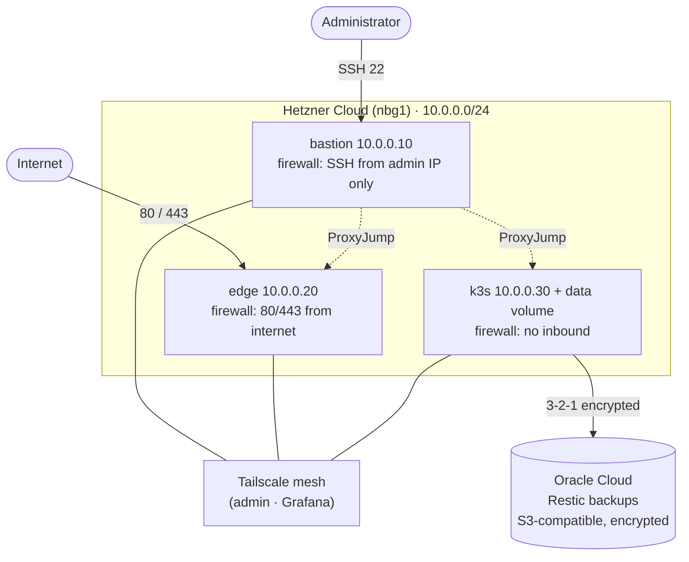
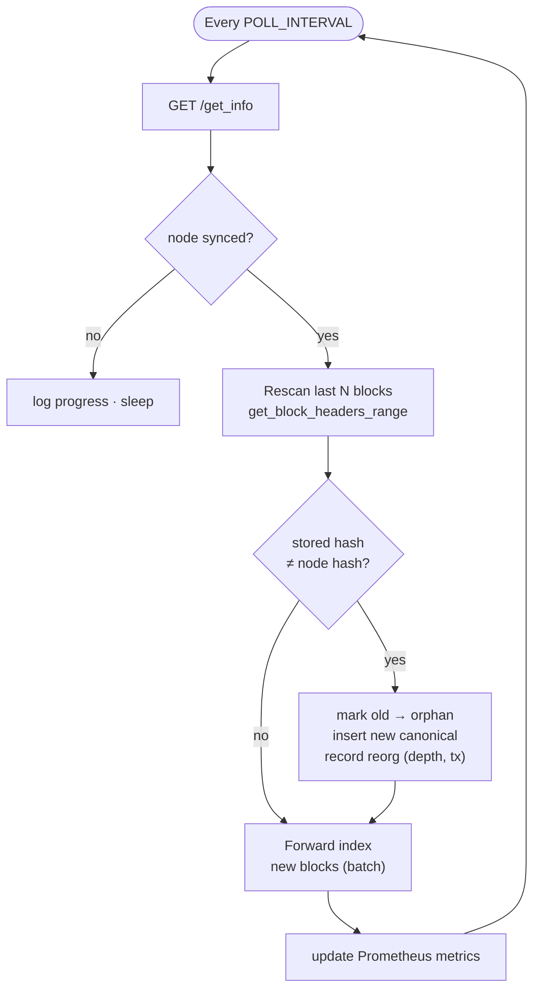
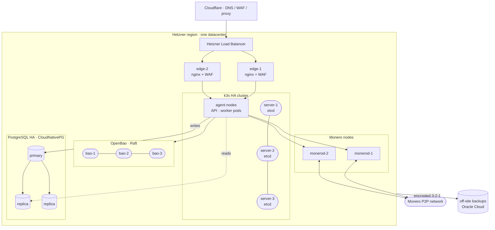
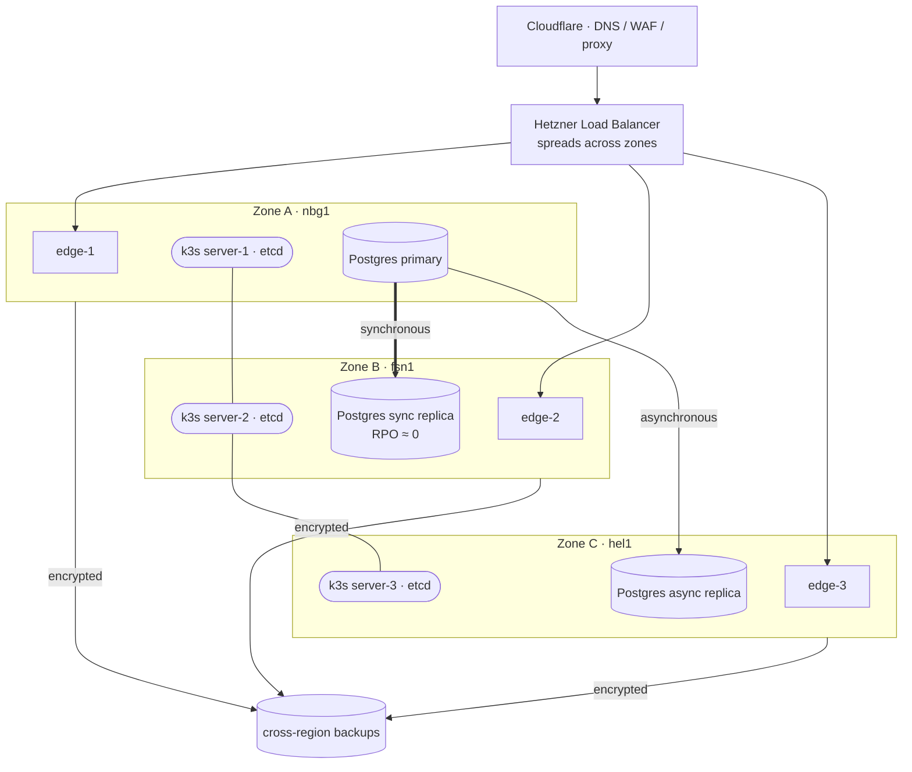
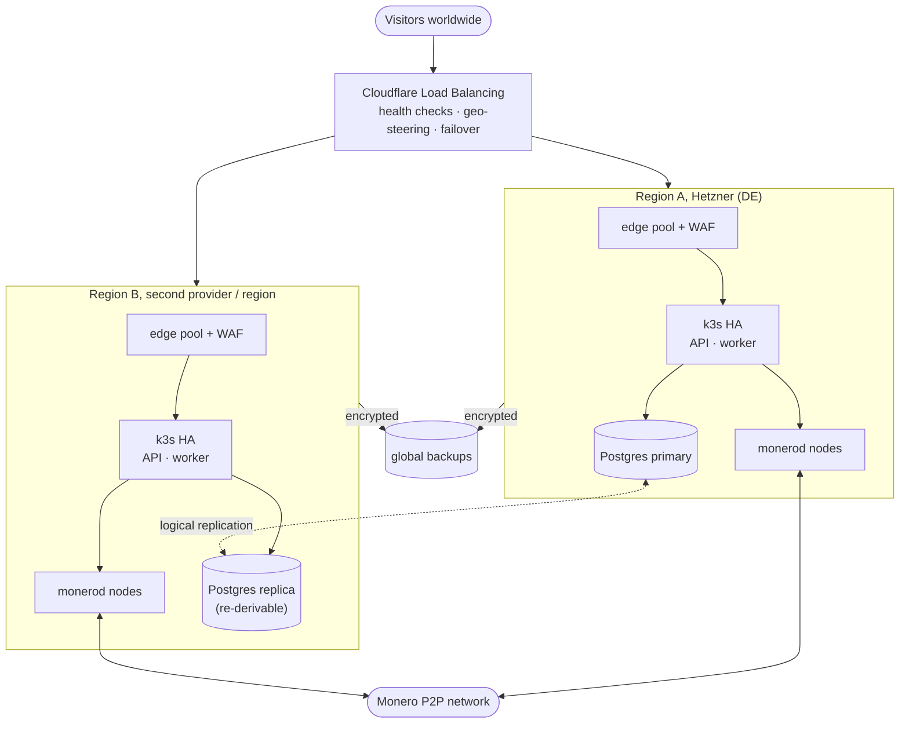

# monerometrics

> A reorg-aware observatory for the health of the Monero network: public dashboard + API.

[](LICENSE)
[](https://www.terraform.io/)
[](https://www.getmonero.org/)

`monerometrics` measures and historizes the health of the Monero network: network hashrate,
block time, mempool state, mining-pool distribution and, above all, **chain reorganizations
(reorgs) and orphan blocks**, which most block explorers surface poorly.

The project was born from the **August 2025 Qubic episode**, during which a mining pool
approached a majority of the network hashrate and triggered reorganizations, raising concerns
about Monero's resilience. The public debate lacked reliable, accessible data to settle it.
monerometrics fills that gap with a neutral, verifiable, reorg-aware observatory.

It is **open-source and self-funded**, with no ads and no tracking. The dashboard and the API
are **free and open, permanently**: there is no paid tier, and there will not be one.

> **From a diploma project to a community tool.** monerometrics V1 was built and defended as a
> French professional IT-infrastructure project, and it earned the diploma. With that chapter
> closed, the goal of V2 is to hand the project over to the **Monero community**: fully
> open-source, self-funded, and useful well beyond a classroom.

- **Dashboard**: [monerometrics.net](https://monerometrics.net)
- **Public API**: [api.monerometrics.net](https://api.monerometrics.net) (OpenAPI documented)
- **MCP server**: `https://api.monerometrics.net/mcp` (Streamable HTTP; in the [MCP Registry](https://registry.modelcontextprotocol.io/?search=monerometrics))
- **Tor hidden service**: `6wbhchvavey26lbtscl6w6qg76balycixtsklcggrsslyk4xah6sbbad.onion`
  (dashboard + API, no Cloudflare, no IP exposure, see [Access over Tor](#access-over-tor))

---

## What it does

- **Dashboard**: a React SPA organised in four sections. *Consensus and reorganizations*: an
  interactive chain-fork visualizer that draws competing branches as a tree, plus reorg statistics
  and orphan history. Each block names its pool and how the attribution was established
  (proven, claimed or inferred), and merge-mined blocks are flagged. *Mining concentration*: pool
  distribution with **largest-pool share and the Nakamoto coefficient**, and the evidence behind
  each attribution. *Network state*: hashrate, block-time variance, mempool, emission, and a
  **transaction fee estimator** reading the node's four priority tiers live. *Peer-to-peer market*:
  Haveno premium over spot, resting liquidity, and **premium by payment method**. Available in
  **English, French and Spanish**, light/dark themes.
- **Public API**: FastAPI, read-only JSON endpoints grouped by theme (service, network,
  chain/reorgs, pools, market). Automatically documented via OpenAPI.
- **Reorg detection**: a Python worker reads each block from a synced node, computes the
  indicators and **detects reorganizations** by re-checking a rolling window of recent blocks
  against the node, recording their real depth and the transactions they displaced.

## Architecture

A visitor reaches the dashboard or API through Cloudflare, which terminates TLS and applies its
edge protections, then forwards to a hardened **edge** server (nginx + ModSecurity WAF). The
edge serves the static dashboard and reverse-proxies the API to the **k3s** node, where the
application core runs: a Monero node, the indexer, PostgreSQL and the API.

A second, independent path exists: a **Tor hidden service** running on the edge, which bypasses
Cloudflare entirely and serves both the dashboard and the API on a single origin.


```mermaid
flowchart LR
    User(["Visitor"]) -->|HTTPS| CF["Cloudflare<br/>DNS · WAF · proxy"]
    CF -->|"HTTP/2 origin pull"| Edge
    Tor(["Tor visitor"]) -.->|"Tor network"| Onion
    subgraph HZ["Hetzner Cloud · private network 10.0.0.0/24"]
        Onion["tor daemon<br/>hidden service v3"]
        Edge["edge 10.0.0.20<br/>nginx + ModSecurity WAF<br/>static dashboard"]
        Onion -.->|"127.0.0.1:8080"| Edge
        subgraph K3S["k3s 10.0.0.30 · no public ingress"]
            API["FastAPI"]
            Worker["Python worker<br/>(indexer)"]
            DB[("PostgreSQL 17")]
            Node["monerod 0.18<br/>pruned"]
        end
        Edge -->|"api. proxy_pass"| API
        API --> DB
        Worker --> DB
        Worker -->|JSON-RPC| Node
    end
    Node <-->|"P2P sync"| Monero(["Monero network"])
    API -.->|"XMR price (cached)"| Price(["CoinGecko · Kraken<br/>Haveno (RetoSwap)"])
```

## Access over Tor

The dashboard is also published as a **Tor v3 hidden service**, giving a path to the data that
does not depend on Cloudflare and does not expose the visitor's IP address:

```
6wbhchvavey26lbtscl6w6qg76balycixtsklcggrsslyk4xah6sbbad.onion
```

Design notes:

- **One origin, no leaks.** The hidden service serves the dashboard on `/` and reverse-proxies
  the API under `/api`. The SPA detects an `.onion` host at runtime and switches to that
  relative path, so **no browser request ever leaves the hidden service** for the clearnet.
  A single build serves both clearnet and Tor.
- **No TLS, on purpose.** Tor already encrypts and authenticates end to end, and the `.onion`
  address *is* the service's public key. A certificate would add nothing.
- **Not reachable from the internet.** The `.onion` vhost listens on `127.0.0.1:8080` only, so
  the Tor daemon is the sole thing that can reach it, no firewall rule, no exposed port. Tor
  makes outbound connections only; nothing inbound is opened.
- **No logs.** Every request arrives from `127.0.0.1` (Tor carries no client IP), so access
  logging is disabled on this vhost: it would record nothing useful.
- **Discoverable.** The clearnet site advertises the service with an `Onion-Location` header,
  so Tor Browser offers to switch automatically.
- **Rate limiting.** Since per-IP limiting is meaningless over Tor, hidden-service traffic is
  tagged by nginx and isolated in a dedicated bucket with a much higher ceiling, the API stays
  protected from abuse without Tor users evicting each other. The tagging header is stripped on
  the clearnet vhosts, so it cannot be forged from the internet.

It is deployed by the `tor` Ansible role (`config/ansible/roles/tor/`).

## Infrastructure

The platform runs on **Hetzner Cloud** (region Nuremberg) as three Ubuntu 24.04 servers on a
private network, each protected by its own Hetzner firewall. Administration is done over a
**Tailscale** (WireGuard) zero-trust mesh; Grafana is reachable over Tailscale only, never from
the internet. The encrypted off-site backups live on a separate cloud (**Oracle Cloud**,
S3-compatible object storage) to isolate failure domains.


```mermaid
flowchart TB
    Admin(["Administrator"]) -->|"SSH 22"| Bastion
    Internet(["Internet"]) -->|"80 / 443"| Edge
    subgraph HZ["Hetzner Cloud (nbg1) · 10.0.0.0/24"]
        Bastion["bastion 10.0.0.10<br/>firewall: SSH from admin IP only"]
        Edge["edge 10.0.0.20<br/>firewall: 80/443 from internet"]
        K3s["k3s 10.0.0.30 + data volume<br/>firewall: no inbound"]
        Bastion -. ProxyJump .-> Edge
        Bastion -. ProxyJump .-> K3s
    end
    Mesh["Tailscale mesh<br/>(admin · Grafana)"]
    Bastion --- Mesh
    Edge --- Mesh
    K3s --- Mesh
    OCI[("Oracle Cloud<br/>Restic backups<br/>S3-compatible, encrypted")]
    K3s -->|"3-2-1 encrypted"| OCI
```

| Server | Type | Public exposure | Role |
|---|---|---|---|
| `bastion` | CX23 | SSH from admin IP only | Sole SSH entry point, ProxyJump to the others |
| `edge` | CX23 | 80/443 from the internet | nginx reverse proxy + ModSecurity WAF, serves the static dashboard |
| `k3s` | CX33 + 128 GB volume | none (outbound only) | k3s cluster: monerod, worker, PostgreSQL, API, OpenBao |

### Running cost

Taken from the Hetzner invoice, per hour of use, excluding VAT:

| Item | Unit price | Monthly (730 h) |
| --- | --- | --- |
| 2 × CX23 (`bastion`, `edge`) | 0.0088 €/h | 12.85 € |
| 1 × CX33 (`k3s`) | 0.0136 €/h | 9.93 € |
| 3 × primary IPv4 | 0.0008 €/h | 1.75 € |
| 128 GB volume | 0.0572 €/GB-month | 7.32 € |
| **Total** | | **31.85 € excl. VAT · 38.22 € incl. VAT** |

Cloudflare, Let's Encrypt, Tailscale and GitHub Actions are on free tiers.

The volume is the item that moves. The pruned Monero blockchain occupies 104 GB of it, while the
entire indexed database of 3.7 M blocks takes 2 GB, about 572 bytes per block.

Growth is measured from the indexed data rather than estimated. Summing the recorded size of every
canonical block gives 186.8 GB for the full chain against 104 GB on disk, so this pruned node keeps
**56 %** of Monero. The chain grew **22.18 GB over the last twelve full months**, which is
**12.35 GB a year on disk**, steady across years (17.5 GB in 2022, 18.3 in 2023, 29.1 in 2024,
22.2 in 2025). At 93 % full, the 128 GB volume saturates in roughly eight months, so the plan is to take it
to 160 GB (+1.83 €/month) and no further, since the same measurement says larger would sit unused.

Storage is driven by the chain, not by indexing: the database adds about 150 MB a year.

Key choices:

- **Defense in depth.** Per-server firewalls, a single SSH entry point, a WAF on the only public
  web surface, a zero-trust admin mesh, and a k3s node with **no inbound exposure at all**
  (admin and edge reach it over the private network; its public IP is outbound-only, for node
  sync and image pulls).
- **HTTP/2 origin behind Cloudflare.** Both the client-facing (Cloudflare) and origin (nginx)
  hops run HTTP/2, with the ModSecurity WAF fully active on HTTP/2 traffic.
- **Everything is Infrastructure-as-Code.** Hetzner resources via **Terraform**
  (`hcloud` + `cloudflare` providers), server configuration and CIS-aligned hardening via
  **Ansible**. Container images are built and published to GHCR.
- **Secrets.** The cluster is provisioned with **OpenBao** (a free fork of Vault) and the
  manifests carry no plaintext credential. In the current state OpenBao is sealed, and the
  workloads read their database credentials from a Kubernetes Secret
  (`postgres-credentials-fallback`) instead. Unsealing is a manual step after any restart, which
  is the trade-off of running a single node; the fallback keeps the service up meanwhile.
- **Supervision** with **Prometheus + Grafana**; backups with **Restic** (3-2-1, cross-cloud,
  tested restore, see [`k8s/monerometrics/BACKUP-PRA.md`](k8s/monerometrics/BACKUP-PRA.md)).

## How the indexer works

The worker ([`apps/worker/indexer.py`](apps/worker/indexer.py)) is the heart of the project. Every
`POLL_INTERVAL` seconds it asks `monerod` for its state (`/get_info`) and, when the node is
synced, runs **two passes** against the database:

1. **Confirmation-window rescan (reorg detection).** It re-fetches the headers of the last
   `CONFIRMATION_WINDOW` blocks (default 60) in a single `get_block_headers_range` call and
   compares each block hash to the canonical hash already stored. Any mismatch is a
   reorganization: the previously stored block is flagged **orphan** (`is_canonical = false`),
   the node's new block becomes canonical, and a row is written to `reorgs_detected` with the
   **real depth** (number of contiguous rewritten heights) and **affected transaction count**
   (sum of the orphaned blocks' tx counts). This pass is what makes reorg detection actually
   work, plain forward-only indexing never revisits the past, so it would silently miss every
   reorg that rewrites already-indexed heights.

2. **Forward indexing.** It then fetches the new blocks above the last indexed height. Close to
   the tip it pulls **full blocks** one by one for accurate pool attribution; when it is far
   behind (fresh deploy), it switches to a **fast header backfill** (`get_block_headers_range`,
   ~1000 blocks per call), which is enough for the network-health series and lets the long
   windows (90 d, 1 y, 5 y) fill with real history in well under two hours instead of never.


```mermaid
flowchart TB
    Start(["Every POLL_INTERVAL"]) --> Info["GET /get_info"]
    Info --> Sync{"node synced?"}
    Sync -->|no| Wait["log progress · sleep"]
    Sync -->|yes| Rescan["Rescan last N blocks<br/>get_block_headers_range"]
    Rescan --> Diff{"stored hash<br/>≠ node hash?"}
    Diff -->|yes| Reorg["mark old → orphan<br/>insert new canonical<br/>record reorg (depth, tx)"]
    Diff -->|no| Fwd
    Reorg --> Fwd["Forward index<br/>new blocks (batch)"]
    Fwd --> Metrics["update Prometheus metrics"]
    Metrics --> Start
```

## Mining-pool attribution

Monero is private by design: a coinbase transaction carries no pool name, and stealth addresses
mean you cannot simply look up "who was paid". Attribution therefore has to be **established**,
never assumed, and every public tracker faces the same wall.

monerometrics never infers a pool's share from its **self-reported hashrate** (the number pools
publish on their own site, which nothing on-chain backs). It only counts blocks it can tie to a
pool by evidence, and records **which kind of evidence** was used, per block, in `blocks.pool_source`.

### The three methods, in order of strength

**1. View-key proof, cryptographic (`viewkey_proof`)**

Some pools publish their wallet **primary address** and **secret view key** (see
[blocks.p2pool.observer/proofs](https://blocks.p2pool.observer/proofs)). A view key only reveals
*incoming* transactions; it cannot spend, and the spend key is never disclosed. That is enough to
prove ownership of a coinbase output, with no trust in anyone's API:

```
R          = transaction public key, parsed out of the coinbase tx_extra (tag 0x01)
derivation = 8 · a · R                      (a = the pool's secret view key)
P_expected = Hs(derivation ‖ varint(i)) · G + B    (B = the pool's public spend key)
```

If `P_expected` equals the actual output key at index `i`, that output pays the pool's wallet:
a mathematical fact, independent of any pool API, and therefore **immune to the reporting lag**
that makes fresh blocks look unattributed. Implemented from scratch in
[`apps/worker/pool_proofs.py`](apps/worker/pool_proofs.py) (ed25519 point arithmetic, Keccak-256,
Monero base58), ~33 ms per block.

**2. Pool block lists, cross-referenced (`pool_api`)**

Pools that publish no view key still publish the list of blocks they found. Those lists are
aggregated every ~2 minutes into an index `{block_hash → pool}` and matched **by block hash**, so
the claim is at least anchored to a real block on the canonical chain. The weakness is *latency*,
not correctness: a pool slow to publish leaves its own recent blocks looking `unknown` until it
catches up. A re-attribution pass on every cycle fixes those retroactively.

**3. Coinbase heuristic, structural (`coinbase_heuristic`)**

A coinbase paying many outputs at once is characteristic of P2Pool, which splits the reward
between miners directly on-chain. Used only as a last resort, and labelled as a heuristic.

### Guardrails

- **Keys are self-checked at startup.** Each view key must prove a block that the pool's *own* API
  claims. A key that fails is **dropped**, not used, so a stale or wrong key can never mislabel
  blocks. Logged as `View-key self-check: N verified [...]`.
- **Conflicts are surfaced, not hidden.** If a pool API claims a block that the proof attributes to
  someone else, it is logged and counted in `monerometrics_attribution_conflicts_total`.
- **Unproven claims are flagged.** A pool that publishes a view key should be able to prove its own
  blocks. When it lists one its published key does *not* prove, the block is recorded as
  `pool_api_unproven` rather than presented with the same confidence as a proven one, the key may
  have rotated without being republished, or the claim may simply be wrong. Counted in
  `monerometrics_unproven_claims_total` and surfaced on the dashboard.
- **Proof outranks APIs.** When both are available, the cryptographic result wins.
- **Source health is public.** Reachability and block count per source are published at
  [`/pools/sources`](https://api.monerometrics.net/pools/sources), so a silently failing source is
  visible instead of quietly inflating `unknown`.

### Sources aggregated

| Pool | Endpoint | Method / depth | View-key proof |
|---|---|---|---|
| supportxmr.com | `www.supportxmr.com/api/pool/blocks` | `?limit=` (up to 10000) | ✅ |
| hashvault.pro | `api.hashvault.pro/v3/monero/pool/blocks` | `?limit=&page=0` (up to 10000) | ✅ |
| moneroocean.stream | `api.moneroocean.stream/pool/blocks` | `?limit=100` (pool cap) | ✅ |
| xmrpool.eu | `web.xmrpool.eu:8119/get_blocks` | paginated by `?height=` | ✅ |
| ownblock.xyz | ((no block API) |) | ✅ |
| p2pool (main) | `p2pool.observer/api/pool/blocks` | `?limit=` (up to 1000) | · |
| p2pool (mini) | `mini.p2pool.observer/api/pool/blocks` | `?limit=` | · |
| p2pool (nano) | `nano.p2pool.observer/api/pool/blocks` | `?limit=` | · |
| nanopool.org | `xmr.nanopool.org/api/v1/pool/blocks/0/{n}` | path count (~4600) | · |
| c3pool.com | `api.c3pool.org/pool/blocks` | `?limit=` (up to 10000) | · |
| kryptex.com | `pool.kryptex.com/xmr/api/v1/pool/blocks` | paginated via `next` (~100, pool cap) | · |
| herominers.com | `monero.herominers.com/api/get_blocks` | paginated by `?height=` | · |
| monerohash.com | `monerohash.com/api/get_blocks` | paginated by `?height=` | · |

P2Pool runs three sidechains (main/mini/nano); all three are polled and collapsed into a single
`p2pool` label, since they are one decentralised network from a centralisation standpoint.

### What stays unattributable, and why

About a fifth of blocks end up `unknown` (20 % over the last 7 days, against 40 % proven
cryptographically and 38 % claimed by a pool API), and that number is reported as-is rather than
smoothed over. The reasons are structural:

- **Qubic publishes no block list at all** and no view key, nobody can attribute it.
- **Solo miners** are invisible by design; that is the point of Monero.
- **Some pools expose no working API** (DxPool returns HTTP 500 on every documented endpoint) and
  publish no view key.
- **Very recent blocks** may be genuinely unattributable for a few minutes, until the pool that
  found them publishes, unless the pool provides a view key, in which case they are proven
  immediately.

Every public tracker hits this same ceiling; comparable sites report an even larger unknown share.
The honest move is to show it.

### Merge mining

A merge-mined block is one where a single proof-of-work claims both a Monero block and a block on
an auxiliary chain. The indexer detects it from the `0x03` tag in the coinbase `tx_extra` and stores
the count in `blocks.merge_mining`; the share over a window is published by
[`/chain/provenance`](https://api.monerometrics.net/chain/provenance) and marked with an `M` on each
block in the dashboard's fork visualizer.

It is tracked because it is not a curiosity but a centralization vector: an auxiliary chain can
subsidise miners and pull hashrate toward a single pool, which is how the August 2025 Qubic episode
built up. Around 61 % of blocks are merge-mined over the last 30 days.

The auxiliary chain is **not named**: the on-chain tag carries only a Merkle root, so identifying it
would require querying that chain. We report the count and the root rather than guessing.

**Observability.** The worker exposes Prometheus metrics on `:9100/metrics`, indexing lag, reorg
counter, sync state, pool-index size, blocks proven by view key, attribution conflicts, last-loop
timestamp, and writes a heartbeat file consumed by a Kubernetes liveness probe, so a stalled loop
gets restarted automatically.

## Data model

PostgreSQL, read-only from the API's point of view. Two tables carry the chain record and matter
most ([`k8s/monerometrics/20-configmap-postgres-init.yaml`](k8s/monerometrics/20-configmap-postgres-init.yaml)):

- **`blocks`**, the primary key is the **block hash**, *not* the height. This is deliberate: it
  lets several blocks coexist at the same height (the canonical one plus the orphans left behind
  by a reorg). A **partial unique index** (`UNIQUE (height) WHERE is_canonical`) guarantees there
  is exactly one canonical block per height at any instant. Columns include `height`, `prev_hash`,
  timestamps, `difficulty`, `tx_count`, `miner_pool`, `reward_xmr` (stored as an exact `NUMERIC`,
  not a float) and the `is_canonical` flag. **`pool_source`** records *how* the pool was
  established for that block (`viewkey_proof`, `pool_api` or `coinbase_heuristic`) so a
  consumer can weigh a cryptographic proof differently from a pool's own claim, and `NULL` for
  blocks indexed before provenance tracking existed.
- **`reorgs_detected`**, one row per detected reorganization event: `fork_point_height`, `depth`,
  `old_chain_tip_hash`, `new_chain_tip_hash`, `affected_tx_count` and `detected_at`.

The orphan/canonical split is what powers the dashboard's chain-fork visualizer and the
`/orphans/recent` and `/reorgs/stats` endpoints.

The rest are time series and caches, created by the worker on first run rather than by the init
manifest:

| Table | Written by | Holds |
|---|---|---|
| `mempool_snapshots` | worker, each poll | Pending transaction count over time |
| `fee_snapshots` | worker, every 5 min | The node's four fee tiers, in piconero per byte |
| `price_snapshots` | worker, every 10 min | Centralized spot plus the Haveno book: best and average offer, resting liquidity, offer count |
| `haveno_offers` | worker, every 10 min | Individual open Haveno offers with their payment method |
| `haveno_trades` | worker, hourly | Executed Haveno trades back to May 2024, with payment method |
| `haveno_liquidity` | worker, hourly | Hourly resting liquidity per market, back to November 2024 |
| `spot_daily` | worker, hourly | Daily centralized close, used to price historical trades |
| `pool_sources` | worker | Reachability and block count per pool API |
| `api_usage` | API | External request counter |

Every one of them is a **cache, not a source of truth**: the chain tables are re-derivable from any
`monerod`, and the market tables from `haveno.markets`. That property is what makes the high-availability
plan below cheap.

## API reference

The API ([`apps/api/`](apps/api/)) is **read-only** and returns JSON. It is built with FastAPI,
so an interactive OpenAPI schema is served at
[`api.monerometrics.net/docs`](https://api.monerometrics.net/docs) (raw schema at `/openapi.json`).
Responses for the heavy aggregations are cached (~60 s) and every IP is rate-limited
(300 requests/minute by default; Tor hidden-service traffic gets its own shared bucket with a
higher ceiling, since per-IP limiting is meaningless there); CORS is open for `GET` so the API
can be consumed from anywhere. No key, no account, no tracking.

`window` accepts `1h`, `24h`, `7d`, `30d`, `90d`, `1y`, `5y` unless noted otherwise.

**Service**

| Endpoint | Description |
|---|---|
| `GET /health` | Liveness + database connectivity check. |
| `GET /info` | Global metadata: API version, latest indexed height, total blocks, orphans, reorgs. |
| `GET /usage/external` | Count of external API requests served, excluding this dashboard and the MCP server. |

**Network**

| Endpoint | Description |
|---|---|
| `GET /network/info` | Current state: sync status, mempool size, difficulty, estimated hashrate (live from the node). |
| `GET /network/hashrate?window=` | Historical network hashrate (difficulty / 120 s), bucketed by the window. |
| `GET /network/blocktime?window=` | Variance of the time between consecutive canonical blocks (target 120 s). `window` = `1h\|24h\|7d\|30d`. |
| `GET /network/mempool?window=` | Mempool size (pending transactions) over time, sampled each worker poll. |
| `GET /network/emission?window=` | Average block reward over time · Monero tail emission (~0.6 XMR/block). `window` excludes `1h`. |
| `GET /network/fees` | The node's four fee tiers (slow, normal, fast, fastest), priced for a reference ~1500-byte transaction in XMR and USD. |
| `GET /network/fees/history?window=` | Normal-tier fee over time, in nanonero, for the reference transaction size. `window` accepts `24h`, `7d`, `30d`, `90d`, `1y`. |

**Chain & reorgs**

| Endpoint | Description |
|---|---|
| `GET /chain/window?from=&to=` | Raw block window between two heights (max 1000 blocks). |
| `GET /chain/provenance?window=` | Evidence quality of our own attribution over the window: how many blocks were proven cryptographically, claimed by a pool API, inferred structurally, or left unattributed · plus claims a pool could not prove with its own published key. `window` = `1h\|6h\|24h\|48h\|7d`. |
| `GET /chain/block/{hash}` | Full detail for one block, read live from the node: coinbase hash, weight and long-term weight, included transaction hashes, merge-mining tags, plus the pool attribution and (for proven blocks) the public proof inputs (wallet address and view key) so anyone can re-verify it. |
| `GET /chain/fork-window?limit=` | Latest N blocks including orphans, with fork-point flags (powers the chain visualizer). `limit` = 10..500. |
| `GET /reorgs?limit=` | Most recent detected reorganizations. `limit` = 1..1000. |
| `GET /reorgs/stats` | Reorg statistics aggregated over 24h / 7d / 30d (count, avg/max depth, affected tx). |
| `GET /orphans/recent?limit=` | Recent orphan blocks with their competing canonical block. `limit` = 1..500. |

**Mining pools**

| Endpoint | Description |
|---|---|
| `GET /pools/distribution?window=` | Block share per pool over the window, plus decentralization metrics: largest-pool share and **Nakamoto coefficient**. `window` = `1h\|6h\|24h\|48h\|7d`. |
| `GET /pools/sources` | Reachability of each pool API used for attribution (status measured by the indexer, not by your browser). |

**Market**

| Endpoint | Description |
|---|---|
| `GET /price` | XMR/USD from a centralized reference (CoinGecko, with Kraken as fallback) **and** the Haveno peer-to-peer street price (RetoSwap network, via `haveno.markets`). Returns `ask_premium_pct`, the lowest Haveno ask over spot, alongside the legacy `premium_pct` computed from the last traded price. Both sources are proxied and cached server-side (~5 s) so the browser never calls them directly. |
| `GET /price/spread?window=` | Haveno order book against centralized spot over time, sampled every 10 minutes: lowest ask, amount-weighted average offer, resting liquidity and offer count. `window` accepts `24h`, `7d`, `30d`, `90d`, `1y`. |
| `GET /haveno/methods?window=&currency=` | Executed Haveno trades grouped by **payment method**, with average, median and standard deviation of the premium over centralized spot. `window` accepts `30d`, `90d`, `180d`, `1y`, `all`; `currency` accepts `USD`, `EUR`. |
| `GET /haveno/liquidity?window=&currency=` | XMR resting in open Haveno offers, hourly, back to November 2024. `currency` accepts `USD`, `EUR`, `AUD`, `GBP`. |
| `GET /haveno/trades?limit=&currency=` | Recent executed Haveno trades with payment method, price and premium. |

**Discovery.** Beyond the documented API, the service answers the agent-discovery conventions crawlers
actually ask for: `llms.txt`, `agents.json`, agent cards, `mcp.json`, OpenRPC, `ai-plugin.json`, x402,
`owners.json`, and the OAuth protected-resource metadata at both the bare path and the RFC 9728 form
with the resource path appended (`/.well-known/oauth-protected-resource/mcp`). Serving these cut the
404 rate on agent traffic from 95% to a few dozen a day.

Requests for endpoints that do not exist get a JSON body listing the interfaces that do, rather than a
bare 404. What the service deliberately does **not** answer is `/v1/models` and its variants: those
probes look for an OpenAI-compatible inference API, and answering them would advertise a capability
this project does not have.

### The price of a payment rail

The interesting question about a no-KYC exchange is not what Monero costs there, it is **what makes
it cost more**. Grouping every executed trade by payment method answers it, and the answer is not
the intuitive one:

| Payment method | Trades | Volume (XMR) | Avg premium | Reversible |
|---|---:|---:|---:|---|
| PayPal | 63 | 25 197 | +14.67% | yes |
| Wise (TransferWise USD) | 86 | 15 756 | +13.60% | yes |
| Cash App | 249 | 67 824 | +10.77% | yes |
| Venmo | 30 | 9 569 | +8.92% | yes |
| Zelle | 466 | 298 361 | +2.60% | no |
| US postal money order | 8 | 4 615 | +1.46% | no |
| Revolut | 89 | 42 209 | +1.41% | yes |
| Cash by mail | 219 | 455 897 | +1.37% | no |

*USD market, 180 days to 24 August 2026, spot reference Kraken daily close.*

**The premium tracks reversibility, not privacy.** A buyer who pays by PayPal or Cash App can file a
chargeback after the Monero has already been released, and there is no recourse, so sellers price
that risk in, at nine to fifteen percent. Rails that cannot be reversed sit near one to three
percent. Cash in an envelope, the most private method on the list, is among the *cheapest*, and
carries the largest volume of any rail.

The `reversible` flag is **our classification, not a Haveno field**. Payment methods with only a
handful of trades produce a fragile premium. The spot reference is a daily close, so intraday moves
add noise, and trades before September 2024 fall outside Kraken's 720-day window and carry no
premium at all. Crypto pairs are excluded: `haveno.markets` quotes them inverted, and a premium
against a fiat spot would be meaningless.

**Reading the Haveno premium.** Three numbers are exposed and they do not mean the same thing.
`ask_premium_pct` compares the **lowest Haveno ask** to centralized spot. `ask_avg_premium_pct`
compares the **amount-weighted average of every sell offer** in the book. The gap between them is
the shape of the book: at the time of writing the top of book sits at −0.2% while the average offer
sits at +9.4%, so the cheapest offer tracks spot and the depth does not. `premium_pct` compares the
**last traded price** to spot; that fill may be hours old in a thin book, so it can overstate the
premium by ten points or more, and it is kept only for backward compatibility.

**Scope: fiat markets only.** Haveno runs 34 markets. The headline liquidity figure on
`haveno.markets` aggregates all of them and sits around 7,900 XMR, but roughly **95% of that is crypto
pairs**: BTC/XMR alone holds about 2,000 XMR and stablecoins another 3,000. Every fiat market combined
is only a few hundred. We index fiat on purpose. A crypto-to-crypto swap is instant, riskless and needs
no counterparty, so those offers cannot drift far from exchange spot and their premium is always near
zero. Fiat peer-to-peer involves a real person, chargeback exposure and delay, and that is the only
reason a premium exists at all. Every figure here is the `XMR_USD` market unless stated otherwise, so
it will read far smaller than the site-wide total, by design.

**What these numbers are not.** The depth endpoint exposes price, amount and offer count, but **not
the payment method** behind each offer. A Haveno offer settled by instant bank transfer and one
settled by cash in the mail carry very different privacy (and very different premiums) yet appear
identically here. The lowest ask is therefore not, on its own, the price of buying Monero privately;
it is the price of the most competitive offer, whatever its payment rail. Note also that `XMR_USD`
is fiat US dollars: `haveno.markets` lists `USDT-ERC20`, `USDT-TRC20`, `USDC-ERC20` and `DAI-ERC20`
as separate markets, so this pair is not a stablecoin quote.

Known limits, stated rather than discovered: only the USD pair carries meaningful volume on Haveno;
offers are advertisements with differing payment methods rather than a matched order book, so the
highest bid can sit above the lowest ask; and history starts on 24 August 2026, when recording began,
because `haveno.markets` exposes no historical series and the spread cannot be backfilled.

## MCP server

The same read-only metrics are exposed to AI assistants through a **Model Context
Protocol** server ([`apps/mcp/`](apps/mcp/)), so any MCP-compatible client (Claude,
IDE agents, …) can query the Monero network directly, no account, no API key.

- **Endpoint** (Streamable HTTP): `https://api.monerometrics.net/mcp`
- **Registry**: published to the official [MCP Registry](https://registry.modelcontextprotocol.io/?search=monerometrics) as `io.github.nowi333/monerometrics`.
- **Tools**: `network_info`, `network_hashrate`, `reorgs`, `reorg_stats`, `recent_orphans`,
  `pool_distribution` (largest-pool share + Nakamoto coefficient), `chain_provenance`,
  `search_block` (by height or hash, down to the genesis block), `get_block`,
  `chain_fork_window`, `price`, and more. Plus a `monerometrics://reference` resource.

It is a thin wrapper over the public REST API (one small FastMCP service), deployed
alongside the API on k3s and routed at `/mcp`.

## Repository layout

```
apps/          Application code
  dashboard/   React + Vite SPA (EN/FR/ES)
  api/         FastAPI service
  mcp/         Model Context Protocol server (thin wrapper over the API)
  worker/      Python indexer (reorg detection) + shared pool module
infra/         Terraform, modules (network, server, dns) + environments
config/        Ansible, inventory, playbooks, roles (hardening, nginx, tor, k3s, ...)
k8s/           Kubernetes (k3s) manifests + backup/DR runbook (BACKUP-PRA.md)
scripts/       Helpers (env loader)
```

## Deploying

The whole platform is reproducible from code. With a Hetzner project, a Cloudflare-managed
domain and the required tokens in your environment:

```bash
# 1. Load tokens (HCLOUD_TOKEN, CLOUDFLARE_API_TOKEN, TAILSCALE_AUTH_KEY, GHCR) from the keychain
source scripts/load-env.sh

# 2. Provision the servers, private network, firewalls and DNS records
cd infra/environments/poc
terraform init
terraform apply        # creates bastion, edge, k3s + Cloudflare A records

# 3. Configure and harden the servers (CIS L1, nginx+WAF, k3s, data volume, Tailscale)
cd ../../../config/ansible
ansible-playbook site.yml

# 4. Deploy the application workloads on k3s
kubectl apply -k k8s/monerometrics/
```

Server sizing, datacenter and the data-volume size are Terraform variables
(see [`infra/environments/poc/terraform.tfvars.example`](infra/environments/poc/terraform.tfvars.example)).

**Secrets live in OpenBao**, and no plaintext credential is committed to the manifests. Seed the
database credentials once, and every consumer (PostgreSQL, worker, API, backup) reads them from
there. If OpenBao is sealed, the workloads fall back to a Kubernetes Secret so the service keeps
running until it is unsealed:

```bash
# Database credentials (read by PostgreSQL, worker, API, backup)
bao kv put secret/postgres/credentials \
  POSTGRES_USER=monerometrics POSTGRES_DB=monerometrics POSTGRES_PASSWORD='<strong-password>'

# Backup credentials, Restic repository + OCI S3-compatible keys (read by the backup job)
bao kv put secret/restic/credentials \
  RESTIC_REPOSITORY='s3:https://<oci-endpoint>/<bucket>' RESTIC_PASSWORD='<restic-password>' \
  AWS_ACCESS_KEY_ID='<key>' AWS_SECRET_ACCESS_KEY='<secret>' AWS_DEFAULT_REGION='<region>'
```

OpenBao Kubernetes auth roles must allow: `monerometrics-postgres` / `-worker` / `-api` to read
`secret/postgres/credentials`, and `monerometrics-backup` to read **both**
`secret/postgres/credentials` and `secret/restic/credentials`.

## Local development (dashboard)

```bash
cd apps/dashboard
npm install
npm run dev      # local dev server
npm run build    # production build to dist/
```

The dashboard reads the public API; point it at `api.monerometrics.net` (see `src/api.js`).

## Toward high availability (target architecture)

> **These topologies are the production target, not what runs today.** The live platform is a
> deliberately lean **single-node POC**: one k3s node (a single point of failure), one
> unreplicated PostgreSQL, one edge. It is honest, cheap (~38 €/month including VAT) and enough to prove the
> product, but the k3s node, the database and the edge are all SPOFs. The plan below removes
> them **in tiers**, each independently fundable, so infrastructure grows with the project's
> community funding rather than ahead of it.

One property makes high availability unusually cheap here: **every metric is deterministically
derived from the Monero blockchain**. The database is a materialized cache, not a source of
truth, any replica or whole region can be **re-indexed from its own local `monerod`**. Reads are
therefore naturally active-active, and losing a stack means rebuilding from first principles, not
losing data.

### Tier 1, Highly-available application, single region

Remove every in-region SPOF: a load balancer in front of a redundant edge pool, a 3-node k3s
control plane (etcd quorum), a replicated PostgreSQL with automatic failover, OpenBao in Raft HA,
and redundant Monero nodes.


```mermaid
flowchart TB
    CF["Cloudflare · DNS / WAF / proxy"] --> LB["Hetzner Load Balancer"]
    subgraph R1["Hetzner region · one datacenter"]
        LB --> E1["edge-1<br/>nginx + WAF"]
        LB --> E2["edge-2<br/>nginx + WAF"]
        subgraph K3S["k3s HA cluster"]
            direction LR
            S1(["server-1<br/>etcd"]) --- S2(["server-2<br/>etcd"]) --- S3(["server-3<br/>etcd"])
            AG["agent nodes<br/>API · worker pods"]
        end
        E1 --> AG
        E2 --> AG
        subgraph PG["PostgreSQL HA · CloudNativePG"]
            PGp[("primary")]
            PGr1[("replica")]
            PGr2[("replica")]
            PGp --> PGr1
            PGp --> PGr2
        end
        AG -->|writes| PGp
        AG -.reads.-> PGr1
        subgraph BAO["OpenBao · Raft"]
            B1(["bao-1"]) --- B2(["bao-2"]) --- B3(["bao-3"])
        end
        AG --> BAO
        subgraph NODES["Monero nodes"]
            N1["monerod-1"]
            N2["monerod-2"]
        end
        AG --> N1
        AG --> N2
    end
    N1 <--> MN(["Monero P2P network"])
    N2 <--> MN
    R1 -->|"encrypted 3-2-1"| OCI[("off-site backups<br/>Oracle Cloud")]
```

### Tier 2, Multi-zone HA (one provider, several datacenters)

Spread the cluster across Hetzner locations (e.g. `nbg1` / `fsn1` / `hel1`). The etcd quorum and
edge pool survive the loss of an entire zone; a **synchronous** PostgreSQL replica in a second
zone gives near-zero RPO on failover, with an asynchronous copy in a third.


```mermaid
flowchart TB
    CF["Cloudflare · DNS / WAF / proxy"] --> LB["Hetzner Load Balancer<br/>spreads across zones"]
    subgraph Z1["Zone A · nbg1"]
        E1["edge-1"]
        S1(["k3s server-1 · etcd"])
        PGp[("Postgres primary")]
    end
    subgraph Z2["Zone B · fsn1"]
        E2["edge-2"]
        S2(["k3s server-2 · etcd"])
        PGs[("Postgres sync replica<br/>RPO ≈ 0")]
    end
    subgraph Z3["Zone C · hel1"]
        E3["edge-3"]
        S3(["k3s server-3 · etcd"])
        PGa[("Postgres async replica")]
    end
    LB --> E1
    LB --> E2
    LB --> E3
    S1 --- S2
    S2 --- S3
    PGp ==>|"synchronous"| PGs
    PGp -->|"asynchronous"| PGa
    Z1 -->|encrypted| BK[("cross-region backups")]
    Z2 -->|encrypted| BK
    Z3 -->|encrypted| BK
```

### Tier 3, Multi-region active-active (aspirational)

Two (or more) full stacks in different regions/providers, steered by **Cloudflare Load
Balancing** with health checks, geo-routing to the nearest healthy region and automatic failover.
Each region indexes from its **own** Monero nodes, so read traffic is served locally and a region
can be rebuilt independently; only the write path needs coordinated replication.


```mermaid
flowchart TB
    Users(["Visitors worldwide"]) --> CFLB["Cloudflare Load Balancing<br/>health checks · geo-steering · failover"]
    CFLB --> RA
    CFLB --> RB
    subgraph RA["Region A, Hetzner (DE)"]
        EA["edge pool + WAF"]
        KA["k3s HA<br/>API · worker"]
        NA["monerod nodes"]
        DA[("Postgres primary")]
        EA --> KA
        KA --> DA
        KA --> NA
    end
    subgraph RB["Region B, second provider / region"]
        EB["edge pool + WAF"]
        KB["k3s HA<br/>API · worker"]
        NB["monerod nodes"]
        DB[("Postgres replica<br/>(re-derivable)")]
        EB --> KB
        KB --> DB
        KB --> NB
    end
    DA <-.->|"logical replication"| DB
    NA <--> MN(["Monero P2P network"])
    NB <--> MN
    RA -->|encrypted| BK[("global backups")]
    RB -->|encrypted| BK
```

## Security & secrets

- **No secret in the repo.** Credentials are pulled from the macOS Keychain / environment at
  runtime (`scripts/load-env.sh`) or stored in OpenBao. Terraform state is kept out of the repo.
- Defense in depth: firewall segmentation, SSH bastion, WAF, zero-trust admin mesh, risk analysis
  (EBIOS RM) and a tested cross-cloud disaster-recovery plan.

## Contact

Questions about the methodology, a number that looks wrong, a pool wanting its view key indexed,
or a researcher after a dataset: **contact@monerometrics.net**. Bug reports and feature requests
are better as [GitHub issues](https://github.com/nowi333/monerometrics/issues), where they stay
public and searchable.

## Support the project

monerometrics runs on a modest self-funded infrastructure (no ads, no tracking, no data sold),
about 38 € a month including VAT. Donations in XMR go to:

```
41mkUSrcAvdGw9E19a83rsh9zdSNC7m8PP34NvmRCCPLZVot61kJHc9i8KGge5JmxkDTuiz7a2nUtE7C4rcQJn4xKjfFyU2
```

Any other cryptocurrency works too, settled to that address with no account and no KYC, through
[trocador.app AnonPay](https://trocador.app/anonpay/?ticker_to=xmr&network_to=Mainnet&donation=True&name=monerometrics&description=Support%20monerometrics&buttonbgcolor=ff6600&address=41mkUSrcAvdGw9E19a83rsh9zdSNC7m8PP34NvmRCCPLZVot61kJHc9i8KGge5JmxkDTuiz7a2nUtE7C4rcQJn4xKjfFyU2).

The same address is published on the dashboard and in
[`/.well-known/owners.json`](https://api.monerometrics.net/.well-known/owners.json), so it can be
cross-checked against three independent sources before you send anything.

## License

MIT, see [`LICENSE`](LICENSE).

---

**No advertising. No tracking. No data sold. Just Monero network data, done honestly.**
